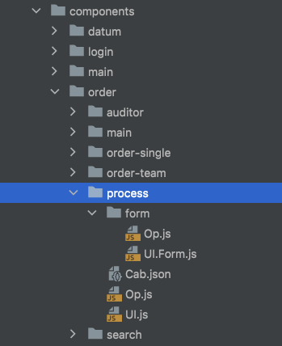
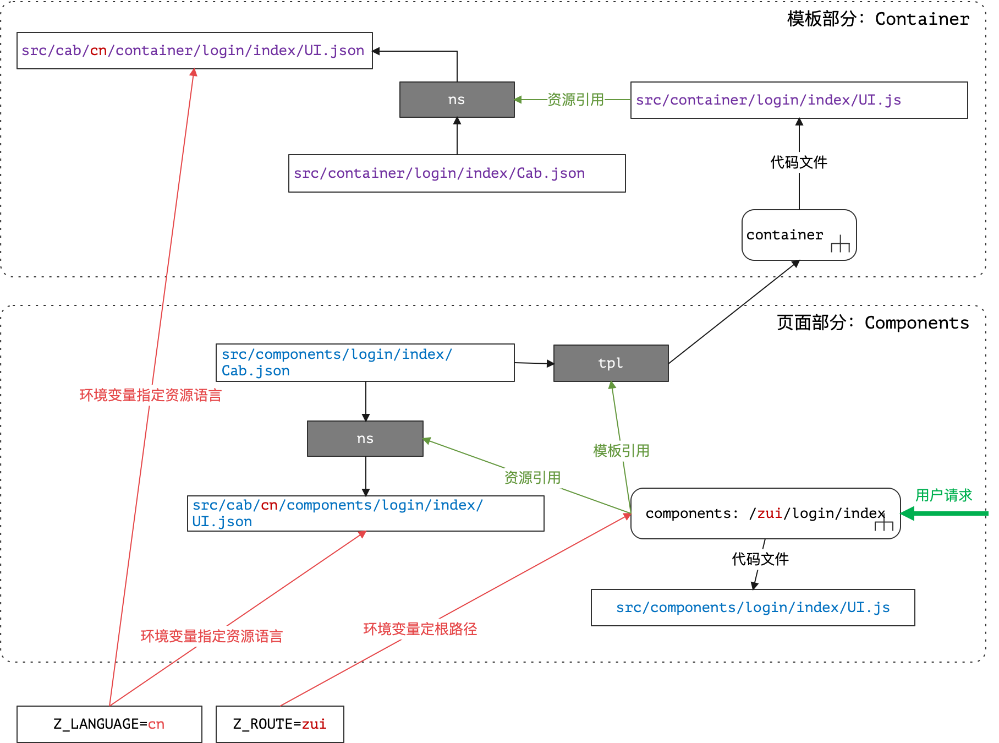

> 朝阳之谷，神曰天吴，是为水伯。在𧈫北两水间。其为兽也，八首人面，八足八尾，皆青黄。——《海外东经》

* 项目地址：<https://github.com/silentbalanceyh/vertx-ui/>

&ensp;&ensp;&ensp;&ensp;本篇为前端篇，`zero-ui`是结合Zero Extension扩展模块量身打造的前端脚手架，本篇主要讲解该脚手架的用法，让开发人员可以直接使用该脚手架实现快速开发，相关API文档参考如下链接。

* [Zero Ui](http://www.vertxui.cn/document/doc-web/index.html)（Ux）
* [Zero Extension](http://www.vertxui.cn/document/doc-web-extension/index.html)（Ex）

&ensp;&ensp;&ensp;&ensp;实现技术栈

* ReactJs
* Ant-Design（3.x）
* Yarn/Webpack

# 「壹」基本介绍

## 1.1. 目录说明

&ensp;&ensp;&ensp;&ensp;zero-ui的详细目录信息如下：

> 带「**应用**」的为开发人员可自由发挥的专用目录。

|目录/子目录|说明|
|---|:---|
|.zero|Zero AI注入项目的核心配置目录，和<http://www.vertxai.cn>配合使用的工作空间。|
|build|生产环境专用输出目录，可直接配置到服务器中运行，该目录不会提交到Github源码中。|
|config|研发专用Webpack配置目录，`webpack.config.js`为配置主文件。|
|document|文档专用目录，包括JsDoc配置目录。|
|public|静态资源文件，包含静态站点对应的图片、HTML等文件。|
|scripts|自动化脚本、启动脚本、脚手架启动脚本。|
|src/app|**「应用」**，（`app`）单个项目专用组件包和功能包。|
|src/cab|**「应用」**，多语言专用资源包，界面呈现使用的配置文件。|
|src/components|**「应用」**，应用页面专用开发包。|
|src/container|**「应用」**，应用模板专用开发包。|
|src/economy|（`web`）Zero Ui展示层可重用组件包。|
|src/entity|（`entity`）Zero Ui框架模型层，TypeScript数据对象。|
|src/environment|（`environment`）Zero Ui框架环境包，包中含有`ES7`语法中的`@zero`注解（核心注解）。|
|src/extension|（`ex,ei,ox`）Zero Ui Extension可重用组件扩展包。|
|src/mock|**「应用」**，（`mock`）Zero Ui框架专用模拟数据Mock包。|
|src/plugin|**「应用」**，（`plugin`）Zero Ui框架插件专用包。|
|src/style|Zero Ui风格文件。|
|src/ux|（`ux`）Zero Ui通用工具包。|
|.babelrc|Babel配置文件。|
|.env.development|开发环境变量文件。|
|.env.production|生产环境配置文件。|
|.eslintignore|Eslint配置文件。|
|.gitignore|Git忽略专用Ignore文件。|
|package.json|NPM包配置文件。|
|run-cache.sh|缓存清除脚本。|
|run-doc.sh|API文档生成脚本。|
|run-update.sh|NPM包更新配置脚本。|
|run-ux-current.sh|更新包专用分发脚本。|
|run-zero.bat|**「应用」**，开发专用启动脚本（Windows）。|
|run-zero.sh|**「应用」**，开发专用启动脚本（Mac/Linux）。|
|tsconfig.json|TypeScript配置文件。|

&ensp;&ensp;&ensp;&ensp;上述文档有几个核心点需说明：

1. 括号内的名称可以直接在使用时使用`import`语法以解决相对路径问题，如：

    ```js
    // 早期代码（可能是很多人使用前端遇到过的问题）
    import Ux from '../../ux';

    // Zero Ui框架中的专用书写代码
    import Ux from 'ux';
    ```
2. Zero UI中引入了`react-router`做路由配置，而路由配置本身递交给自动化脚本实现，所以无需开发人员手工更改路由导出文件（参考`src/components/index.js`，系统自动生成）

    ```js
    import _ci_search from './ci/search/UI';
    //...
    export default {
        _ci_search
        // ...
    }
    ```
3. `cab`资源文件包中会有语言文件目录如`cn`和`en`等，多语言环境下可直接绑定资源文件实现，Zero UI中推荐开发规范中不允许在页面包中书写任何呈现在界面的文字信息，该资源文件和环境变量`Z_LANGUAGE`绑定。
4. 当应用中存在多个模板时，依赖`route.json`中的配置实现模板注入流程，如现存的配置：

    ```json
    {
        "defined": "_module_page",
        "special": {
            "_login_index": [
                "_login_index"
            ]
        }
    }
    ```
    含义为默认使用`container/module/page`模板，而唯有登录页面使用`container/login/index`模板。
5. 除了标记了「**应用**」的项是开发人员会**修改**的项，其他内容无需开发人员更改，直接使用即可。

## 1.2. 环境变量

&ensp;&ensp;&ensp;&ensp;Zero UI中使用了一部分系统环境变量用于指定当前Zero UI运行的宿主的一些信息，这些环境变量可以在最终打包成Docker镜像时直接提供，并且可以进行很灵活的全局化配置。Zero Ui中的环境变量配置在如下两个文件中：

|文件名|环境变量|
|---|:---|
|.env.development|开发环境，Development|
|.env.production|生产环境，Production|

&ensp;&ensp;&ensp;&ensp;Zero Ui中`dgXXX`系列的前缀方法只有在**开发环境**会打印日志，其他环境中不会打印任何日志，也就是说，浏览器的`console`中只会在**开发环境**打印`dgXXX`输出的彩色日志。

### 1.2.1.变量使用

&ensp;&ensp;&ensp;&ensp;Zero Ui中使用下边示例代码读取系统环境变量：

```js
import Ux from "ux";
import React from "react";

class A extends React.PureComponent{
    render(){
        const app = Ux.Env.APP; // 直接引用环境变量
        return false;
    }
}
```

&ensp;&ensp;&ensp;&ensp;**自定义环境变量全部是大写加下划线**。

* 非Zero Ui定义的环境变量（`NodeJS`环境）可直接使用`Ux.Env.XXX`读取。
* Zero Ui定义的所有环境变量带有`Z_`前缀，调用时去掉`Z_`即可调用，如上边示例代码中的环境变量是`Z_APP`，而代码中是`Ux.Env.APP`直接使用。

### 1.2.2.变量列表

*应用环境*

|外部环境变量|脚本中的引用方法|备注|
|:---|:---|:---|
|PORT|无|当前App运行的端口号|
|HOST|无|当前App运行的host地址|
|Z\_TITLE|Ux.Env.TITLE|当前应用运行的标题，HTML中的&lt;header&gt;部分|
|Z\_APP|Ux.Env.APP|当前App的名称，该名称为系统唯一标识符，和配置中心可连接|
|Z\_ENDPOINT|Ux.Env.ENDPOINT|当前App需要连接的远程后端EndPoint地址，前后端分离架构下专用|
|Z\_LANGUAGE|Ux.Env.LANGUAGE|当前App运行的语言标识符，该语言标识符会对应到cab包中的目录，如默认语言为：cn，则所有资源文件目录位于：src/cab/cn/目录下|
|Z\_ROUTE|Ux.Env.ROUTE|当前App的动态路由根路径，不同的应用该值应该设置为不同，所有的ReactRouter的路径都是放在该变量下运行|
|Z\_K\_SESSION|无（用于构造Session专用）|当前App在使用SessionStorage时对应的Key前缀，默认使用@@ZUI/，使用前缀可在同一个浏览器中登陆不同的App应用且不会有数据冲突|
||Ux.Env.KEY\_APP|当前应用保存的SessionStorage|
||Ux.Env.KEY\_USER|当前应用保存的用户专用Session|
|Z\_K\_EVENT|Ux.Env.KEY\_EVENT|当前App使用的Redux状态时候的事件前缀，用于区分不同Redux行为专用，默认值为@@ZUI-ACT|
||Ux.Env.HTTP11|HTTP1.1的头文件常量|
||Ux.Env.HTTP\_METHOD|Http方法常量|
||Ux.Env.MIMES|常用MIME映射文件|
|Z\_CORS\_MODE|Ux.Env.CORS\_MODE|跨域的基本模式，对应到fetch中的选项Option的值：cors，no-cors，或者提供相关的域信息。|
|Z\_CORS\_CREDENTIALS|Ux.Env.CORS\_CREDENTIALS|对应Options中的credentials选项，包括include,omit，或者提供相关的域信息。|
|Z\_SIGN|Ux.Env.SIGN|是否启用数字签名功能，默认false|
|Z\_CSS\_PREFIX|Ux.Env.CSS\_PREFIX|当前站点的风格文件专用前缀设置，该设置需要定义Less的全局变量@app|
|Z\_CSS\_COLOR|Ux.Env.CSS\_COLOR|当前站点的主色调，一旦改动了这个颜色过后，所有按钮边框和效果都会被更改，对应到AntDesign中的@primary-color的值。|
|Z\_SHARED|Ux.Env.SHARED|全局Epic和Types共享目录名称，默认值为app，所以共享内容位于src/app/action的目录下|
|Z\_ENTRY\_LOGIN|Ux.Env.ENTRY\_LOGIN|当前应用的登录首页|
|Z\_ENTRY\_ADMIN|Ux.Env.ENTRY\_ADMIN|当前应用的管理首页【带登录控制】，关于管理首页可以直接将该页面开发成根据不同角色的分离器，这样就可以完成应用入口根据不同授权的分离功能。|
|Z\_X\_HEADER\_SUPPORT||启用X-Sigma、X-AppId、X-AppKey和X-Lang实现多租户、多语言、多应用的平台环境。|

*开发专用环境*

|外部环境变量|脚本中的引用方法|备注|
|:---|:---|:---|
|Z\_DEV\_DEBUG|Ux.Env.DEBUG|是否开启Debug模式，Debug模式中才可看见对应的日志信息|
|Z\_DEV\_MOCK|Ux.Env.MOCK|是否打开全局的Mock功能，如果打开就可以支持Mock分离于后端的开发模式|
|Z\_DEV\_FORM||监控表单渲染的专用变量，牵涉到表单的布局渲染流程|
|Z\_DEV\_MONITOR|Ux.Env.MONITOR|是否启用ZeroUI中支持的原生监控工具，会有一个监控工具栏出现在浏览器的下方。|
|Z\_DEV\_AJAX|Ux.Env.DEBUG\_AJAX|是否将Ajax请求保存成Json文件格式，如果调试模式打开，Request请求将保存成Json格式，每次请求都会存储一次。|

&ensp;&ensp;&ensp;&ensp;**几个开发人员关注的核心环境变量如**：

1. `Z_LANGUAGE`多语言环境专用环境变量，用于指定当前Zero Ui应用访问`cab/`之下的哪个目录中的资源文件，若是中文则`cn`，若英文则`en`或其他，很容易做语言替换。
2. `Z_ENDPOINT`远程API的RESTful端地址，前后端通过该地址访问后端远程接口。
3. `Z_ROUTE`前端专用路由，它表示：`http://localhost:8080/<ROUTE>/login/index`中的`<ROUTE>`部分。
4. `Z_APP`和后端`X_APP`表中名称对应，当Zero Ui从后端读取配置数据时依靠该值从后端读取应用配置。
5. `Z_CSS_COLOR`和`Z_CSS_FONT`定制主风格和主字体大小，可定制不同皮肤。

*参考文件*

```properties
PORT=8080
Z_TITLE=应用系统名称
Z_LANGUAGE=cn
Z_ENDPOINT=http://ox.engine.cn:7000
Z_APP=app.micro.hotel
Z_ROUTE=htl
Z_SHARED=hotel
Z_ENTRY_LOGIN=/login/index
Z_ENTRY_ADMIN=/main/index
Z_PLUGIN=true
Z_K_SESSION=@@RTV/
Z_K_EVENT=@@OX-HT
REACT_APP_LESS_MODULES=true

Z_DEV_DEBUG=true
Z_DEV_MOCK=true
Z_DEV_AJAX=false
Z_DEV_FORM=true
Z_DEV_MONITOR=false

Z_CSS_PREFIX=ht
Z_CSS_COLOR=#36648b
Z_CSS_FONT=13px
Z_CORS_CREDENTIALS=include

Z_X_HEADER_SUPPORT=true
```

## 1.3. 包说明

&ensp;&ensp;&ensp;&ensp;Zero Ui中的包代码通常如（全部使用包名）：

```js
import Ux from 'ux';
```

&ensp;&ensp;&ensp;&ensp;Zero Ui中所有的包列表如下：

|包名|含义|
|---|:---|
|environment|基础环境信息专用包，定义了当前系统需使用的全局环境，如`react-router, redux, reducers, store, @zero`注解等。|
|entity|TypeScript定义的数据模型专员包，包含核心数据模型（包括查询树）。|
|lang|语言包，和`Z_LANGUAGE`绑定的语言资源包，编程过程一般不会使用，但`@zero`注解会使用该信息，默认读取`cab/cn/`下的资源文件。|
|web|「**UI**」Zero Ui标准交互式组件包。|
|app|**「应用」**，第三方专用项目可重用包。|
|mock|**「应用」**，模拟数据包，类似mock server功能。|
|plugin|**「应用」**，第三方专用项目插件包，开发部分组件插件。|
|ux|「**Fn**」Zero Ui中的通用核心工具包，常用函数。|
|ex|「**Fn**」Zero Extension通用工具包，常用扩展函数。|
|ei|「**UI**」Zero Extension交互式组件包。|
|oi|「**UI**」Zero Origin X可配置的交互式组件包（Json为主，后端拉配置，动态渲染）。|

&ensp;&ensp;&ensp;&ensp;注意不同的导入方式：

```js
// 组件导入方式
import { Dialog } from 'web';
import { ExComplexList } from 'ei';
// 函数导入方式
import Ux from 'ux';
import Ex from 'ex';
```

## 1.4. 编程规范

&ensp;&ensp;&ensp;&ensp;本小节详细说明Zero中的开发规范，给开发人员提供基本指导规则。

1. 所有的Zero Extension组件使用`Ex`前缀命名，而Zero Origin X可配置组件使用`Ox`前缀命名。
2. Zero Ui中的`react-router`通常只使用两级结构，即`container/components`目录中都只有两级结构（通过实践证明两级结构足够使用了）。
3. 一个页面所有的文件都包含在单个目录中，资源文件使用同名模式，如下两个文件：

    ```shell
    # 组件资源文件（假设Z_LANGUAGE=cn）
    cab/cn/components/login/index/UI.json
    src/components/login/index/UI.js
    ```
4. 所有页面主文件使用`UI.js`文件名，子页面则使用`UI.js`或`Web.jsx`来实现界面渲染。
5. 所有操作类文件全部使用`Op.js`文件名。
6. 所有页面名空间链接文件统一使用`Cab.json`配置（配置内容参考下边讲解）。
7. 所有页面风格文件使用`Cab.less`文件。
8. 函数名有几种：
    1. 表单操作类函数名统一使用`$opXXX`函数名（方便后端绑定）。
    2. 普通JS函数一律使用`fn`做函数前缀。
    3. 自定义触发韩剧一律使用`rx`做函数前缀。
    4. 事件绑定函数同HTML，使用`on`做函数前缀。
    5. 状态函数（禁用、启用、二次提交）一律使用`do`做函数前缀。
9. 从父组件传入属性进入子组件时，包含变量名如：
    1. `$a_`前缀的变量主要为字典类数据，数据类型如`DataArray`。
    2. `__`前缀的变量是内部对象，一般是组合对象使用该类型。
    3. `_`前缀的函数存在于单个文件中，为内部函数，不`export`的函数使用该前缀。
    4. `$`前缀的变量则表示自定义变量信息。
10. 资源文件中的根节点一律使用`_`前缀用于区分数据节点和配置节点。

&ensp;&ensp;&ensp;&ensp;如下截图参考：



# 「贰」结构解析

## 2.1. 路径结构

&ensp;&ensp;&ensp;&ensp;假设您访问了前端：`http://localhost:5000/ox/login/index`，这个URL地址中详细内容如下：

|项|说明|
|---|---|
|localhost|前端主机地址，可通过环境变量`HOST`配置。|
|5000|前端端口号，可通过环境变量`PORT`配置。|
|ox|前端路由地址，不同应用使用不环境变量不同，就可以使得一套代码同时部署多应用，`Z_ROUTE`配置。|
|login/index|直接定位页面源文件`src/components/login/index/UI.js`渲染。|

## 2.2. 页面结构

&ensp;&ensp;&ensp;&ensp;假设系统中包含了两个文件：

|文件|含义|
|---|---|
|src/container/login/index/UI.js|模板文件|
|src/components/login/index/UI.js|页面文件|

&ensp;&ensp;&ensp;&ensp;呈现页面结构如下：


&ensp;&ensp;&ensp;&ensp;模板是多个页面可共享的文件，而页面文件是每个地址对应的专用代码，在源码文件`src`中包含一个`route.json`的链接文件，可用于定义多个模板，目前版本的弊端是这种多个模板必须手工指定第二模板所包含的页面，而不能自动化：


&ensp;&ensp;&ensp;&ensp;该文件内容示例：

```json
{
    "defined": "_module_page",
    "special": {
        "_login_index": [
            "_login_index"
        ]
    }
}
```

1. 默认模板是`_module_page`，即`container/module/page/UI.js`模板（系统中页面默认使用该模板）。
2. 第二模板是`_login_index`，即`container/login/index/UI.js`模板，使用了第二模板的页面只有一个`_login_index`，即`components/login/index/UI.js`页面。
3. 您还可以指定第三模板以及更多，模板配置可以放在`route.json`中（低优先级），也可以放在页面对应的`Cab.json`中（高优先级）。

&ensp;&ensp;&ensp;&ensp;上述配置文件是**旧版本**的写法，**新版**的自动路由规则中，`route.json`优先级被降低，可以只配置`defined`的默认布局：

```json
{
    "defined": "_module_page"
}
```

&ensp;&ensp;&ensp;&ensp;而原来的`_login_index`配置在`components/login/index/Cab.json`的名空间文件中，它的配置如：

```json
{
    "ns": "components/login/index",
    "tpl": "_login_index"
}
```

&ensp;&ensp;&ensp;&ensp;上述文件的`tpl`意味着当前页面使用的是`_login_index`模板，而不是`_module_page`的模板。

### 自动路由规则

|约定|说明|
|---|:---|
|模板目录|src/container/|
|页面目录|src/components/|
|入口文件|UI.js|
|目录层级|只能使用二级目录，即类似`components/login/index/`。|

> 启动时运行`run-zero.bat/run-zero.sh`脚本，路由会自动生成挂载到`react-router`中。

## 2.3. 名空间文件`Cab.json`

&ensp;&ensp;&ensp;&ensp;名空间文件一般位于当前页面之下，比如页面`components/pay/tool`目录，下边会有一个`Cab.json`文件，内容如：

```json
{
    "ns": "components/pay/tool"
}
```

&ensp;&ensp;&ensp;&ensp;`ns`全称为`namespace`，而它的根目录从`src/cab/<Z_LANGUAGE>`开始计算，所以上述绑定的**资源目录**为`src/cab/cn/components/pay/tool`目录（假设`Z_LANGUAGE=cn`），问题来了，绑定哪个文件呢？参考下边代码（`UI.js`）：


```js
// 注解修饰
@Ux.zero(Ux.rxEtat(require("./Cab"))
    .cab("UI")      // 此处的 UI 证明它绑定的文件名为 UI.json
    .to()
)
// 类定义
class Component extends React.PureComponent{
    // 核心渲染方法
    render(){
        return ...
    }
}
// 组件导出
export default Component
```

&ensp;&ensp;&ensp;&ensp;结合自动路由规则，上述代码可展开成如下结构：



&ensp;&ensp;&ensp;&ensp;注意：

1. 上述结构中，假设模板`container/login/index/UI.js`也绑定了一个模板资源文件。
2. 注意图中的两个影响页面的环境变量`Z_ROUTE`和`Z_LANGUAGE`，一个影响访问时的根路径，另一个会影响绑定资源文件时的语言目录。
3. `tpl`引用模板是新版才有的功能，您也可以不使用它，而使用老版本方法引用模板，如果系统无法检索模板时才会使用默认模板，优先级如：

    |文件|配置键|优先级|
    |---|---|---|
    |Cab.json|tpl|最高|
    |route.json|special|高|
    |route.json|defined|默认|
4. 资源文件的读取在后续示例中会讲解`Ux.fromHoc`和`Ux.fromPath`即可。

# 「叁」开发步骤

## 3.1. 工程初始化

&ensp;&ensp;&ensp;&ensp;您可以使用`Zero Ai`工具直接初始化前端工程，一键式（测试版）：

* 安装地址：[http://www.vertxai.cn/](http://www.vertxai.cn/)

```shell
# 0.3.3 版本中可用
ai init -n test-demo
```
&ensp;&ensp;&ensp;&ensp;运行命令后的输出如下

```shell
~/Develop/Source/uniform-ui » ai init -n test-demo                                                 
[Zero AI] Zero AI 代码生成工具  : <标准工具>
[Zero AI] HomePage   : http://www.vertxai.cn
[Zero AI] Github     : https://github.com/silentbalanceyh/vertx-ai.git
[Zero AI] Version    : 0.3.3  「确认您的Node版本 ( >= 14.x ) 支持ES6, ES7.」
[Zero AI] Zero AI 系统启动......
[Zero AI] Zero AI 加载输入参数：
{
    "name": "test-demo"
}
[Zero AI] 工程构建目录：test-demo
Cloning into 'test-demo'...
remote: Enumerating objects: 888, done.
remote: Counting objects: 100% (888/888), done.
remote: Compressing objects: 100% (538/538), done.
remote: Total 36593 (delta 445), reused 610 (delta 339), pack-reused 35705
Receiving objects: 100% (36593/36593), 29.09 MiB | 151.00 KiB/s, done.
Resolving deltas: 100% (24009/24009), done.
[Zero AI] 执行工程初始化：test-demo
[Zero AI] （Sync）成功将数据写入到文件：test-demo/package.json！
[Zero AI] 执行后期处理：......
[Zero AI] 资源清理中：rm -rf test-demo/.zero/*
[Zero AI] 资源清理中：rm -rf test-demo/document/doc-web/*
[Zero AI] 资源清理中：rm -rf test-demo/document/doc-web-extension/*
[Zero AI] 资源清理中：rm -rf test-demo/guide/
[Zero AI] 资源清理中：rm -rf test-demo/_config.yml
[Zero AI] 资源清理中：rm -rf test-demo/CNAME
[Zero AI] 资源清理中：rm -rf test-demo/data.json
[Zero AI] 资源清理中：rm -rf test-demo/LICENSE
[Zero AI] 资源清理中：rm -rf test-demo/package-lock.json
[Zero AI] 资源清理中：rm -rf test-demo/yarn.lock
[Zero AI] 工程初始化完成：test-demo，您可以开始您的Zero Ui之行了！
```

## 3.2. 运行框架

&ensp;&ensp;&ensp;&ensp;命令执行完后，您可以在环境中看到`test-demo`目录：

1. `cd test-demo`：执行该命令进入新创建的目录中。
2. `yarn install`：也可执行`npm install`，推荐使用`yarn`初始化项目。
3. `./run-zero.sh`：执行启动框架命令启动vertx-ui框架。
4. 运行之后从浏览器中打开：<http://localhost:5100/zui/login/index>即可。

&ensp;&ensp;&ensp;&ensp;如果您要启动自己的新项目，需修改如下环境变量：

|变量|项目|
|---|:---|
|`PORT`|修改您的前端的端口。|
|`Z_ENDPOINT`|修改您的后端RESTful端地址（推荐用域名映射后结果）。|
|`Z_APP`|修改您的应用名称（`vie.app` + 缩略名）。|
|`Z_ROUTE`|修改您的应用前端路径。|
|`Z_K_SESSION`|修改Session Key对应前缀。|
|`Z_K_EVENT`|修改Redux事件名前缀。|
|`Z_CSS_PREFIX`|修改您的CSS风格专用前缀。|
|`Z_CSS_COLOR`|修改您的主颜色风格。|

# 「肆」小结

&ensp;&ensp;&ensp;&ensp;到这里，Zero Ui的基础就已经讲解完了，接下来您就可以开始您的Zero Ui（vertx-ui）正式之旅了。