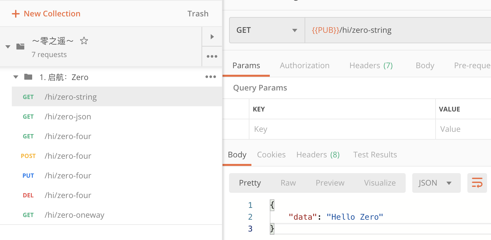

# 1. 启航：Zero

> &ensp;&ensp;&ensp;&ensp;青丘之山有兽焉，其状如狐而九尾，其音如婴儿，能食人，食者不蛊。——《山海经》

* 项目地址：<https://github.com/silentbalanceyh/vertx-zero-example/>（子项目：**up-apollo**）

## 「壹」第一个Api

&ensp;&ensp;&ensp;&ensp;任何软件教程的第一章，似乎都有一个《Hello World》的程序，当然，Zero也不例外，曾经我觉得换个词语会好点，所以使用了：`Hello Origin`
，但对读者而言，似乎太陌生了，回归到正轨上，还是决定采用原生态的`Hello World`，在您的Maven项目中创建第一个Java类。

```java
package cn.vertxup.micro.hello;

import io.vertx.core.json.JsonObject;
import io.vertx.up.annotations.EndPoint;

import javax.ws.rs.GET;
import javax.ws.rs.Path;

@EndPoint
public class HiAgent {
    /*
     * 返回值：
     * {
     *     "data": "Hello Zero"
     * }
     */
    @GET
    @Path("/hi/zero-string")
    public String sayHello() {
        return "Hello Zero";
    }

    /*
     * 返回值：
     * {
     *     "data": {
     *         "message": "Hello Zero"
     *     }
     * }
     */
    @GET
    @Path("/hi/zero-json")
    public JsonObject sayHelloJ() {
        return new JsonObject().put("message", "Hello Zero");
    }
}
```

&ensp;&ensp;&ensp;&ensp;创建好该Java类过后，可以直接启动`ApolloUp`主程序，在控制台您可以看到如下日志信息：

```shell
[ ZERO ] ( Uri Register ) "/hi/zero-json" has been deployed by ZeroHttpAgent, ...
[ ZERO ] ( Uri Register ) "/hi/zero-string" has been deployed by ZeroHttpAgent, ...
```

&ensp;&ensp;&ensp;&ensp;然后您就可以使用`Postman`测试运行结果，得到注释中的返回值。

<hr/>

## 「贰」何为Zero？

### 2.1. 简介

&ensp;&ensp;&ensp;&ensp;尝试过启动`Zero`系统后，读者一定会对`Zero`有所疑惑，究竟它可以用来做什么？

&ensp;&ensp;&ensp;&ensp;Zero是一个基于`vert.x`的快速开发框架，它的设计参考了`spring-boot`的设计思路，尽可能用简化的配置去开发企业应用后端，目前已经有两个在生产环境运行的完整案例，它支持**
单机运行**模式，同样也支持**微服务**模型集群运行。为了最大限度简化开发人员的技术工作量，Zero也有配套的前端框架Zero UI，二者结合，在项目开发过程中提高**交付**效率。

### 2.2. 设计目标

&ensp;&ensp;&ensp;&ensp;最初设计开发`Zero`只是为了能够更快速度开发企业产品和交付项目，所以在设计`Zero`的过程中携带了更多**项目特性**
，它并非一个纯技术框架，为了兼容技术人员的胃口，2019年，它被彻底拆分成：`Zero`和`Zero Extension`两部分，原始框架为纯技术性框架，而`Zero Extension`
携带了通常开发过程中的企业应用常用模块如RBAC模型、多应用、多租户、多语言、动态路由、图、工作流等核心企业服务模块。简言之，`Zero`原生框架依旧是一个单纯的技术框架，而带上**扩展包**
后可迅速开发企业应用如OA、ERP、酒店管理、进销存、互联网金融、CMDB、ITIL等。它的设计目标如下：

* 在`vert.x`中做一个应用框架的尝试（由于原生态的`vert.x`并没有类似的开发框架），让很多曾经开发过`spring`的开发人员可以无缝转移到`vert.x`开发中来。
* 在实际开发过程中提高开发人员的开发效率和交付效率，让开发人员在技术基础之上真正集中于**需求**——一流的需求缔造一流的产品。
* 在企业产品研发中，提高产品研发效率，让开发人员关注产品内容本身，而不是陷在错综复杂的技术细节中，软件本身就是服务于行业和人而存在的工具，并不是一个技术秀场。

> &ensp;&ensp;&ensp;&ensp;接下来我们继续深入到 Zero 中，不断去解读这个框架带来的福利，虽然我不保证它是完美的，但是它确实如设计之初，是实用的。

<hr/>

## 「叁」开发步骤

&ensp;&ensp;&ensp;&ensp;细心的读者会发现，除了几个特殊的Annotation以外，Zero大量支持了JSR311的规范，使用这种设计的目的是让Zero不会变得**怪异**或者**特立独行**
。Zero的启动程序在项目首页已经有相关说明，它的**同步**接口开发步骤如下（后续会逐步讲解`Zero`中的异步模式）：

1. 在新创建的Java类上使用注解`io.vertx.up.annotations.EndPoint`，该类必须是public的。
2. 使用JSR311注解该类中的**实例方法**，每一个方法对应一个RESTful接口。
3. 然后启动`Zero`，该方法中的逻辑就为RESTful接口逻辑。

&ensp;&ensp;&ensp;&ensp;在项目中书写下边代码：

```java
package cn.vertxup.micro.hello;

import io.vertx.up.annotations.EndPoint;

import javax.ws.rs.*;

@EndPoint
public class FullAgent {
    /*
     * 响应：
     * {
     *      "data": "Hello Get"
     * }
     */
    @GET
    @Path("/hi/zero-four")
    public String sayGet() {
        return "Hello Get";
    }

    /*
     * 响应：
     * {
     *      "data": "Hello Post"
     * }
     */
    @POST
    @Path("/hi/zero-four")
    public String sayPost() {
        return "Hello Post";
    }

    /*
     * 响应：
     * {
     *      "data": "Hello Delete"
     * }
     */
    @DELETE
    @Path("/hi/zero-four")
    public String sayDelete() {
        return "Hello Delete";
    }

    /*
     * 响应：
     * {
     *      "data": "Hello Put"
     * }
     */
    @PUT
    @Path("/hi/zero-four")
    public String sayPut() {
        return "Hello Put";
    }

    /*
     * 响应：
     * {
     *      "data": true
     * }
     */
    @GET
    @Path("/hi/zero-oneway")
    public void sayOneWay() {
        System.err.println("No Response");
    }
}
```

&ensp;&ensp;&ensp;&ensp;书写了上述代码后，可以使用Postman发送相关请求，得到注释中的结果，这里有几点需要说明：

* 一个URI路径中是支持多种HTTP方法的，可使用上边的`@GET, @POST, @DELETE, @PUT`进行区分。
* 最后一个方法使用了`Zero`定义的**One-Way**模式——即不关心响应结果，该请求发送过后，它的方法会被执行，可以在控制台看到`No Response`输出，在响应结果中，如果是`true`表示正常执行，`false`
  则表示异常执行，这种方式通常用于一些特殊的**信号请求**场景。
* 注意在使用Postman发请求的时候，需要切换HTTP方法才可输出不同的结果，如下图。



<hr/>

## 「肆」数据规范

&ensp;&ensp;&ensp;&ensp;怎样？是不是很简单就开发了一系列的RESTful API？有很多朋友问我，Zero中的响应数据为什么不是直接数据，而是类似下边这种格式：

```json
{
    "data": "...."
}
```

&ensp;&ensp;&ensp;&ensp;这并不是框架本身设计的一种失误，这种模式主要是为了统一数据规范，在实际的企业应用中，前后端是配合操作的，并不是各自为阵，我个人觉得这种设计有几个好处：

### 4.1. 统一解析

&ensp;&ensp;&ensp;&ensp;通常在前端调用中，通常会在Js中写如下代码：

```js
    /* Zero Ui 中对 ajax 执行了封装，直接解析 data 节点内容。*/
    Ux.ajaxPost("/hi/zero-four").then(data => {
         /* 代码逻辑 */
    });
    /* 原生代码 */
    <Promise>.then(responseText => {
        const data = responseText.data;
        /* Data Process */
    })
```

&ensp;&ensp;&ensp;&ensp;如果响应格式使用的`true, 1, Hello`以及Json的对象，那么意味着这里需要处理很多判断逻辑，才能够拿到响应结果，而`Zero`
对响应结果做过一层封装，这种情况下，就可以使用统一的解析代码，类似上边提到的`Ux.ajaxPost`的模式实现数据的统一解析，当然这只是一种对前端的约定，它对前端实现了这样一种契约：“不论响应如何，只要正确，请从我的`data`
节点去提取数据内容”。

### 4.2. 动态扩展

&ensp;&ensp;&ensp;&ensp;这种数据格式的描述，可以在数据内容层直接扩展，比如将上述响应转换成：

```json
{
    "data": "数据内容",
    "extension": "扩展Js插件",
    "metadata": "数据定义"
}
```

&ensp;&ensp;&ensp;&ensp;在这种场景中，`data`节点可维持原始的**数据内容**，而让这份数据变得不单纯，并且具有自描述性，可以这样理解：当前端收到这种响应格式时，它表示在原始数据基础之上通过`extension`
的解析实现数据在接口层的处理，这种处理包括转换、过滤等都可以，这样的话响应信息就变活了。

&ensp;&ensp;&ensp;&ensp;这种设计可以帮助开发接口实现**反向定制**，如果不想修改该接口的原始逻辑，就在前端使用插件方式设计`extension`，并且将`extension`
的插件名称作为扩展部分存储在服务端，当客户端接收到服务过来的元数据时，可以直接实现接口层的隐藏逻辑，在保证数据本身内容不发生任何结构改变的情况下实现接口的多样化。

&ensp;&ensp;&ensp;&ensp;目前的版本中，Zero一直都维持着这种数据规范，除了**下载**接口（二进制数据）以外，其他所有的接口返回结果都遵循本章节提到的格式，必须遵循。

> 真正的企业应用，不是一个Demo，也不是一个例子，更多时候充斥着各种复杂多变的需求，让数据本身适应变化也是在企业应用设计中的一种模式，数据的自描述性和自适应性也是Zero提供给开发人员的利器，从目前生产环境运行的CMDB平台看来，有些特殊的需求也许只需要在extension中注入一段脚本，就可以不改变原始逻辑而实现。

## 「伍」总结

&ensp;&ensp;&ensp;&ensp;本章节初次打开了`Zero`这个潘多拉魔盒，故事也是从此处开始，我不保证在整个系列教程中会去写一些和概念相关的东西，但是尽可能保证开发人员透过该教程知道如何使用`Zero`
——甚至于让它成为企业级开发中的利刃。

　　

　　

　　

