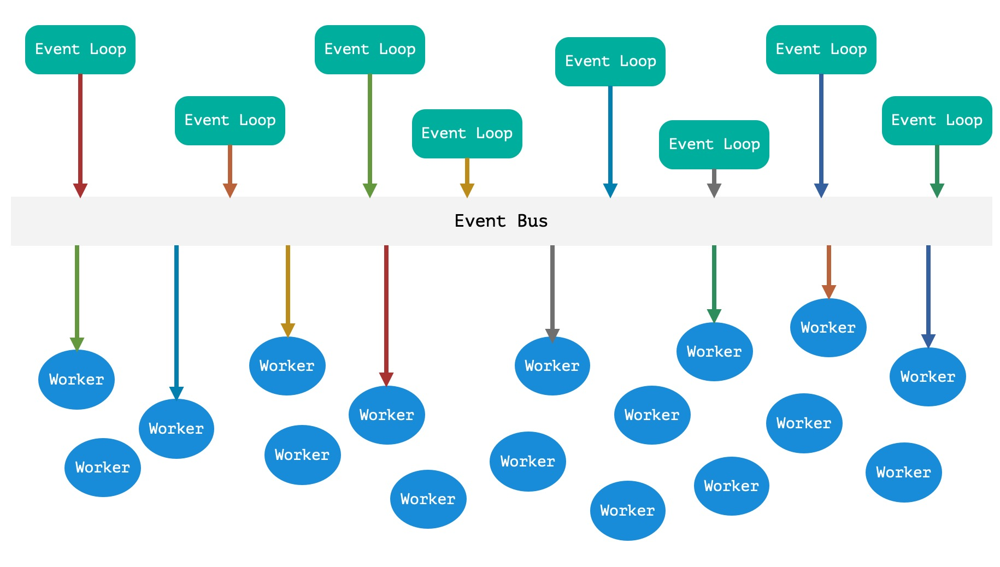
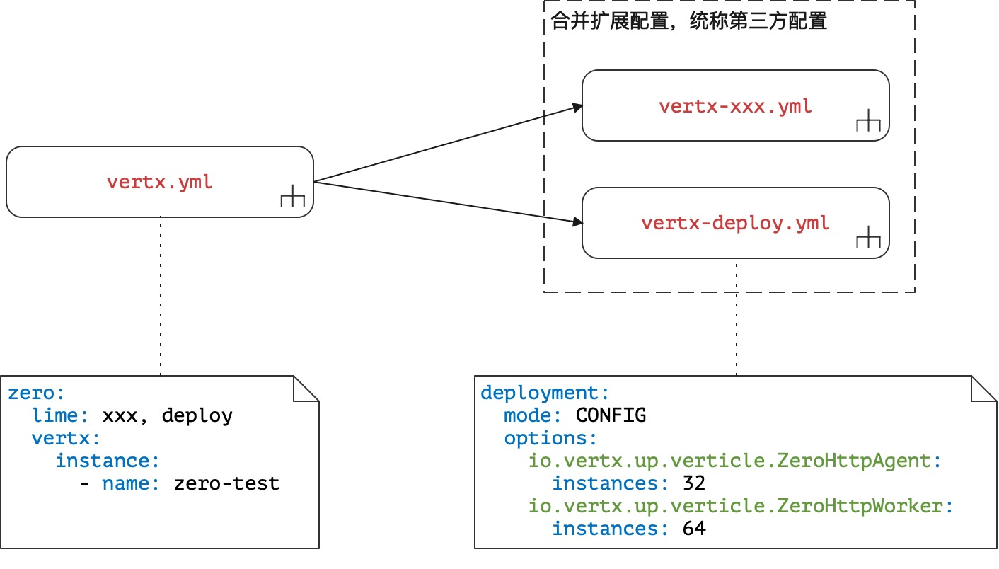

# 8. 铁马冰河：细谈Worker

> 操吴戈兮被犀甲，车错毂兮短兵接。——屈原《九歌·国殇》

* 项目地址：<https://github.com/silentbalanceyh/vertx-zero-example/>（子项目：**up-rhea**）

## 「壹」函数签名

&ensp;&ensp;&ensp;&ensp;前边所有的章节都在告诉读者如何使用JSR311和JSR303书写一个Agent组件，虽然部分代码中包含了Worker组件的写法，但并未细讲Worker，本章节通过更多的示例告诉读者如何书写Zero中的Worker组件。一旦使用Worker组件则意味着您将启用EventBus并使用异步数据流，为了照顾大部分人，所以在Zero中支持三种风格的Worker编程，您可以读完本章后自行选择。

### 1.1. 开发步骤

&ensp;&ensp;&ensp;&ensp;前文中提到了Agent组件的常规代码，通常如下：

```java
package cn.vertxup.worker;

import io.vertx.core.json.JsonObject;
import io.vertx.up.annotations.EndPoint;

import javax.ws.rs.BodyParam;
import javax.ws.rs.POST;
import javax.ws.rs.Path;

@EndPoint
@Path("/hi/worker")
public class ModeAgent {
    @POST
    @Path("/standard")
    public String hiWorker(@BodyParam final JsonObject json) {
        return json.encode();
    }
}
```

&ensp;&ensp;&ensp;&ensp;直接发送请求会收到类似如下响应：

```json
{
    "data": "{\"username\":\"Lang\"}"
}
```

&ensp;&ensp;&ensp;&ensp;接下来稍做改动：

```java
// 增加@Address的导入
import io.vertx.up.annotations.Address;
// 直接将方法代码改成如下：
    @POST
    @Path("/standard")
    @Address("ZERO://WORKER/STANDARD")
    public String hiWorker(@BodyParam final JsonObject json) {
        return json.encode();
    }
```

&ensp;&ensp;&ensp;&ensp;这种情况直接启动会看到如下输出：

```shell
io.vertx.zero.exception.WorkerMissingException: [ERR-40014] (EventDiffer) \
ZeroException occurs: Zero detected that there is no method of @Queue \
annotated @Address = ZERO://WORKER/STANDARD, the worker missing.
```

&ensp;&ensp;&ensp;&ensp;上述输出明确告诉了开发者：您启用了Worker组件但对定义的`ZERO://WORKER/STANDARD`地址并没有找到和它对应的**Worker组件**，然后针对这个地址添加新代码。

```java
package cn.vertxup.worker;

import io.vertx.up.annotations.Address;
import io.vertx.up.annotations.Queue;
import io.vertx.up.commune.Envelop;
import io.vertx.up.unity.Ux;

@Queue
public class ModeActor {
    @Address("ZERO://WORKER/STANDARD")
    public void hiWorker(final Envelop envelop) {
        final String strData = Ux.getString(envelop);
        System.out.println(strData);
    }
}
```

&ensp;&ensp;&ensp;&ensp;再发送请求就得到下边响应：

```json
{
    "data": true
}
```

&ensp;&ensp;&ensp;&ensp;这样一个Agent/Worker组件就完全开发好了，总结一下引入Worker的开发步骤：

1. 创建一个Java类，可以是class也可以是interface（本章后续章节会讲解），该类使用`@EndPoint`注解。
2. 书写该类中的方法，并对该类使用JSR311中的注解定义RESTful相关元素。
3. 使用`@Address`注解并设置常量字符串定义EventBus通讯地址。
4. 书写Worker类，并使用`@Queue`和`@Address`注解定义Worker的代码执行逻辑。

### 1.2. 部署配置

&ensp;&ensp;&ensp;&ensp;继续看Agent/Worker代码之前先来关注一下基本配置信息，一旦在Zero中部署了所有的Worker和Agent过后，整个线程池就形成了下图这种结构（为了突出异步操作，数据流用了彩色）：



&ensp;&ensp;&ensp;&ensp;从上图可以知道，Agent实例和Worker实例的数量是不对等的，而本小节将介绍的就是如何在环境中设置部署数量，Zero中执行该部署的配置文件结构如下：



&ensp;&ensp;&ensp;&ensp;右边的`deployment`节点控制了Agent和Worker的线程数量，一般情况二者比例使用`1:2`，这个也可以在不同生产环境中进行微调；除了上图演示的`instances`
属性以外，该节点还包含了其他的属性信息，对应到DeploymentOptions类中。

## 「贰」三足鼎立

&ensp;&ensp;&ensp;&ensp;Zero对Worker组件的方法签名进行了详细设计，本章就一一讲解签名的三种核心类型：

1. 同步入参和返回值。
2. Handler模式（`io.vertx.core.eventbus.Message`入参，void返回值）。
3. 异步入参和返回值（`io.vertx.core.Future`模式）。

&ensp;&ensp;&ensp;&ensp;还有一点您可以放心，不论使用哪种类型的Worker方法签名，数据流都是**异步**的，而您也不用担心您的同步代码如何**异步化**，这些操作Zero系统会自动完成。

> 后续示例中定义的API根路径都为`/hi/worker`，代码段中只演示核心代码段，完整代码参考`up-rhea`。

### 2.1. 同步模式

#### 2.1.1. 基本形态

&ensp;&ensp;&ensp;&ensp;接下来先看一个示例：

**Agent代码段**

```java
    @GET
    @Path("/sync-one")
    @Address("ZERO://WORKER/SYNC/ONE-WAY")
    public String hiOneWay(@QueryParam("name") final String name) {
        return name;
    }
```

**Worker代码段**

```java
    @Address("ZERO://WORKER/SYNC/ONE-WAY")
    public void hiOneWay(final Envelop envelop) {
        final String strData = Ux.getString(envelop);
        System.out.println(strData);
    }
```

&ensp;&ensp;&ensp;&ensp;发送GET请求到`/hi/worker/sync-one?name=lang.yu`，您将得到如下响应结果：

```json
{
    "data": true
}
```

&ensp;&ensp;&ensp;&ensp;说明点：

1. 如果Worker中的方法返回值为void，且参数为普通类，则模式自动转换成OneWay模式。
2. 如果代码执行没有异常信息，则返回true，否则返回false。
3. Worker的参数限制：长度必须是1，并且参数类型必须是`io.vertx.up.commune.Envelop`。
4. **特别注意**：这种模式中Agent方法的返回值和Envelop中读取数据的API必须匹配。

    ```java
    // Agent中返回 java.lang.String
    public String hiOneWay(...)
    // Worker中提取数据使用下边代码段
    final String strData = Ux.getString(envelop);
    ```

&ensp;&ensp;&ensp;&ensp;如果修改上述代码中Worker代码如：

```java
    public Envelop hiOneWay(final Envelop envelop) {
        final String strData = Ux.getString(envelop);
        return Envelop.success(new JsonObject().put("input", strData));
    }
```

&ensp;&ensp;&ensp;&ensp;响应信息会变成：

```json
{
    "data": {
        "input": "lang.yu"
    }
}
```

#### 2.1.2. 返回值偏态（扩展一）

**Agent代码段**

```java
    @GET
    @Path("/sync-adjust")
    @Address("ZERO://WORKER/SYNC/ONE-ADJUST")
    public String hiAdjust(@QueryParam("name") final String name) {
        return name;
    }
```

**Worker代码段**

```java
    @Address("ZERO://WORKER/SYNC/ONE-ADJUST")
    public JsonObject hiAdjust(final Envelop envelop) {
        final String strData = Ux.getString(envelop);
        return new JsonObject().put("input", strData);
    }
```

&ensp;&ensp;&ensp;&ensp;这种模式下可更换返回值类型为基本Java类型，这样操作的话Zero会自动调用`Envelop.success`
对返回数据进行封装，如此操作就增大了同步模式的自由度，但有一点，如果想要返回一个**错误的信封**，那么还是推荐返回值使用Envelop，因为它会包含两种形态：成功与失败。

#### 2.1.3. 入参偏态（扩展二）

**Agent代码段**

```java
    @GET
    @Path("/sync-adjust2")
    @Address("ZERO://WORKER/SYNC/ONE-ADJUST2")
    public String hiAdjust2(@QueryParam("name") final String name) {
        return name;
    }
```

**Worker代码段**

```java
    @Address("ZERO://WORKER/SYNC/ONE-ADJUST2")
    public Envelop hiAdjust2(final String name) {
        return Envelop.success(new JsonObject().put("input", name));
    }
```

&ensp;&ensp;&ensp;&ensp;这种模式也是同步下的一把利刃，主要原因是返回值有两种状态，打破了方法返回值的唯一性，更符合常规情况下RESTful代码的执行过程，并且更符合常规开发习惯。

#### 2.1.4. 自由态（扩展三）

**Agent代码段**

```java
    @GET
    @Path("/sync-adjust1")
    @Address("ZERO://WORKER/SYNC/ONE-ADJUST1")
    public String hiAdjust1(@QueryParam("name") final String name) {
        return name;
    }
```

**Worker代码段**

```java
    @Address("ZERO://WORKER/SYNC/ONE-ADJUST1")
    public JsonObject hiAdjust1(final String name) {
        return new JsonObject().put("input", name);
    }
```

&ensp;&ensp;&ensp;&ensp;相信这种模式是**您**最喜欢的模式，因为它是**自由的**
，您可以书写任意方法来完成Worker组件的代码逻辑，唯一的限制就是参数只有一个——不用我多说，因为Worker组件拿到的参数就是Agent组件的返回值，由于返回值只有一个，所以第一参数必须是类型匹配的。

#### 2.1.5. 同步汇总

|返回类型|参数类型|形态名|支持RPC|
|---|---|:---|---|
|void/Void|Envelop|标准形态One-Way| x |
|void/Void|T|入参偏态One-Way| x |
|Envelop|Envelop|标配形态| o |
|T|Envelop|返回偏态| o |
|Envelop|T|入参偏态| o |
|T|T|自由态| o |

&ensp;&ensp;&ensp;&ensp;T表示Java语言中的自由数据类型。此处再讨论想何时使用Envelop数据类型：

1.
入参使用Envelop类型：一般除开Agent发送给Worker的数据以外，若您需要在更复杂的应用环境中使用一些额外数据（一般是Vertx中的原生对象如Session，User等），同时您又不想扩展Worker的函数签名则可以使用Envelop类型作为入参。
2.
返回使用Envelop类型：一般出现异常情况时，您可以直接将定义好的WebException抛出而不用关心错误产生时的业务逻辑，但是总会出现一种情况是您需要在异常发生时去执行某些代码逻辑的，这种情况下您就可以使用Envelop类型构造**
双态**返回值。

&ensp;&ensp;&ensp;&ensp;所以，虽然自由态非常好用，但往往在实际场景中可能会面临复杂情况，如何选择同步模式则根据您自己的实际需求而定，从我在前三个Zero项目中的经历看，**同步模式**
一般很少用，大部分场景中都使用了后边提到的**异步模式**，若是异步模式则Envelop类型的使用就只需考虑**入参**一种情况，返回值会直接被`io.vertx.core.Future`接管。

### 2.2. Handler模式

&ensp;&ensp;&ensp;&ensp;Handler模式是为Vert.x量身打造的原始模式，主要是用来连接Vert.x中各种子项目专用的模式。先看看Vert.x中常用的异步代码：

```java
client.getConnection(res -> {
  if (res.succeeded()) {
    SQLConnection connection = res.result();
    connection.query("SELECT * FROM some_table", res2 -> {
      if (res2.succeeded()) {
        ResultSet rs = res2.result();
        // Do something with results
      }
    });
  } else {
    // Failed to get connection - deal with it
  }
});
```

&ensp;&ensp;&ensp;&ensp;上边代码中，逻辑本身是**异步**的，所以在lambda部分的执行使用了异步回调的代码风格，那么请您思考一个问题：如何得到返回结果？有一点很清楚就是直接在lambda中加入类似`return`
的语句是铁定**行不通**的，于是得到返回结果的方法有两种：

1. 继续使用Callback模式（本小节将提到的Zero中的Handler模式）。
2. 将Callback进行封装，返回一个Future（后一小节会提到的异步模式）。

&ensp;&ensp;&ensp;&ensp;那么我们一起看一个示例（注意Message的包，这里提供完整代码）：

**Agent代码**

```java
package cn.vertxup.worker;


import io.vertx.up.annotations.Address;
import io.vertx.up.annotations.EndPoint;

import javax.ws.rs.GET;
import javax.ws.rs.Path;
import javax.ws.rs.QueryParam;

@EndPoint
@Path("/hi/worker")
public class CallAgent {
    @GET
    @Path("/callback")
    @Address("ZERO://WORKER/CALLBACK")
    public String hiAdjust(@QueryParam("name") final String name) {
        return name;
    }
}
```

**Worker代码**

```java
package cn.vertxup.worker;

import io.vertx.core.eventbus.Message;
import io.vertx.core.json.JsonObject;
import io.vertx.up.annotations.Address;
import io.vertx.up.annotations.Queue;
import io.vertx.up.commune.Envelop;
import io.vertx.up.unity.Ux;

@Queue
public class CallActor {

    @Address("ZERO://WORKER/CALLBACK")
    public void hiCallback(final Message<Envelop> message) {
        final Envelop envelop = message.body();
        final String name = Ux.getString(envelop);
        message.reply(Envelop.success(new JsonObject().put("input", name)));
    }
}
```

&ensp;&ensp;&ensp;&ensp;这种模式下，下一个限制就是在`Message`
对象中Zero限制只传输Envelop对象，而不传输Java中的基本类型以及其他类型，这样设计的原因是这种模式在Zero实战过程中，往往只会用于一些特定的场景，最频繁的莫过于和Vert.x中的部分子项目集成。如下边这种用法：

```java
package up.god.micro.tabular;

import io.vertx.core.eventbus.Message;
import io.vertx.core.json.JsonArray;
import io.vertx.ext.sql.ResultSet;
import io.vertx.ext.sql.SQLClient;
import io.vertx.up.aiki.Ux;
import io.vertx.up.annotations.Address;
import io.vertx.up.annotations.Queue;
import io.vertx.up.atom.Envelop;

import javax.inject.infix.MySql;

@Queue
public class DbWorker {

    @MySql
    private transient SQLClient client;

    @Address("ZERO://QUEUE/NATIVE/GET")
    public void sayDb(final Message<Envelop> message) {
        final Envelop envelop = message.body();
        final String type = Ux.getString(envelop);
        this.client.queryWithParams("SELECT * FROM SYS_TABULAR WHERE S_TYPE=?",
                new JsonArray().add(type), handler -> {
                    // Success or Failure
                    if (handler.succeeded()) {
                        final ResultSet res = handler.result();
                        // Build result json array
                        for (final JsonArray item : res.getResults()) {
                            System.out.println(item);
                        }
                        message.reply(Envelop.success(res.getResults()));
                    } else {
                        // Replied with error, now only print stack
                        handler.cause().printStackTrace();
                        message.reply(Envelop.ok());
                    }
                });
    }
}
```

&ensp;&ensp;&ensp;&ensp;上边代码中演示了如何和Vert.x中常用的Client集成，关于Vert.x的集成我们将在后续专程用一个章节来讲解，包括引用了JSR330的依赖注入使得整个代码更加流畅，如上边示例中`@MySql`
的应用；同样下一个章节我会提供一个示例将Handler模式转换成异步模式。

&ensp;&ensp;&ensp;&ensp;所以这种模式汇总只有一个情况：

|返回类型|参数类型|形态名|支持RPC|
|---|---|:---|---|
|void/Void|`Message<Envelop>`|Handler形态| x |

> 强调一下，Handler模式中返回值只能是`void/Void`，不可以是其他类型（Callback模式限制）。

### 2.3. 异步模式

&ensp;&ensp;&ensp;&ensp;看完了前两种模式，我们进入最后一种：**异步模式**，通常我又称为Future模式——这种模式才是Zero在实战中的**主角**
。这种模式下，Worker中的方法返回值使用`io.vertx.core.Future<T>`类型，和同步模式不同，它不关注返回值，汇总后签名只有两种形态：

|返回类型|参数类型|形态名|支持RPC|
|---|---|:---|---|
|`Future<T>`|Envelop|标准型| o |
|`Future<T>`|I|自由型| o |

> I和T都表示Java中的泛型定义，用I意味着I和Future中的T类型可能相同可能不同。

#### 2.3.1. 标准入参

**Agent代码段**

```java
    @GET
    @Path("/async-envelop")
    @Address("ZERO://WORKER/ASYNC/ENVELOP")
    public String hiEnvelop(@QueryParam("name") final String name) {
        return name;
    }
```

**Worker代码段**

```java
    @Address("ZERO://WORKER/ASYNC/ENVELOP")
    public Future<String> hiEnvelop(final Envelop envelop) {
        final String name = envelop.data();
        return Ux.future(name);
    }
```

&ensp;&ensp;&ensp;&ensp;直接发送GET请求：`/hi/worker/async-envelop?name=lang.yu-async`，您可以得到如下输出：

```json
{
    "data": "lang.yu-async"
}
```

#### 2.3.2. 自由入参

**Agent代码段**

```java
    @GET
    @Path("/async-t")
    @Address("ZERO://WORKER/ASYNC/T")
    public String hiT(@QueryParam("name") final String name) {
        return name;
    }
```

**Worker代码段**

```java
    @Address("ZERO://WORKER/ASYNC/T")
    public Future<String> hiT(final String name) {
        return Ux.future(name);
    }
```

&ensp;&ensp;&ensp;&ensp;此处就不看输出了，和上边示例一致。

#### 2.3.3. Handler模式转换

&ensp;&ensp;&ensp;&ensp;本小节主要讲解Handler模式到Future模式的转换代码，以方便您在实际应用过程中左右逢源。实际上Zero中有很多直接针对Handler进行异步转换成Future的代码示例。

**转换伪代码**

```java
// Import部分
import io.vertx.core.AsyncResult;
import io.vertx.core.Future;
import io.vertx.core.Handler;
import io.vertx.core.Promise;

// 3.8.x 之后推荐这样使用，摒弃早期的Future<T> future = Future.future();
final Promise<T> promise = Promise.promise();
// 假设此处 handler 变量就是一个 Handler<AsyncResult<T>> 类型（各种子项目中随处可见）
handler.method(res -> {
    if(res.successed()){
        // 假设返回为T
        final T ret = res.result();
        promise.complete(ret);
    }else{
        // 出现异常
        promise.fail(res.cause());
    }
});
// 最终返回了 Future<T>
final Future<T> future = promise.future();
```

&ensp;&ensp;&ensp;&ensp;除开上边的代码结构，还介绍将`Message<Envelop>`转换成`Handler<AsyncResult<T>>`的简单方法：

```java
// 假设：Message<Envelop> 变量 message
final Handler<AsyncResult<Envelop>> handler = res -> {
    if(res.succeeded()){
        final Envelop success = res.result();
        message.reply(success);
    }else{
        // 异常处理
        final Envelop failure = Envelop.failure(res.cause());
        message.reply(failure);
    }
};
```

&ensp;&ensp;&ensp;&ensp;上述代码在Zero框架内部也比较常见，实际上`Message`
的reply方法异步回调返回的是一个Envelop对象，而由于Envelop有两态（成功和失败），所以直接根据异常信息就构造了返回的最终数据，而这个最终数据进入到Zero的**响应处理器**
时会根据其内部数据直接生成相对应的响应而完成本次异步请求。参考前一篇提到的**容错**，此处您还可以将`res.cause()`替换成自定义的WebException更细粒度化**错误响应**。

> Zero中提供了强大的三工具组合：Fn, Ut, Ux，这部分内容会单独开章节来给您介绍，有了它们您的开发会变得更加流畅。
> - Fn：函数专用工具类，底层函数接口扩展。
> - Ux：Vert.x框架和Zero Extension中常用的工具类。
> - Ut：纯Java工具类，如MD5加密、集合运算，等价于很多项目中的各种Util。

## 「叁」云山之巅

&ensp;&ensp;&ensp;&ensp;看完了前文中的各种示例后，您有没有对Zero中的Worker有更进一步的了解和认识呢？那么本章节一起再入木四分一步，一起看看更加简洁而流畅的代码用法。

### 3.1. 接口模式

&ensp;&ensp;&ensp;&ensp;之前我们遇到的所有Agent组件的示例都是使用Java语言中的class，但很多场景中核心的代码处理逻辑都在Worker组件内，所以这个class中会变得没有实际意义，这种情况下，可以直接将class转成interface定义。

#### 3.1.1. 标准Worker

**Agent代码**

```java
package cn.vertxup.worker;

import io.vertx.up.annotations.Address;
import io.vertx.up.annotations.EndPoint;

import javax.ws.rs.GET;
import javax.ws.rs.Path;
import javax.ws.rs.QueryParam;

@EndPoint
@Path("/hi/worker")
public interface AsyncApi {
    @GET
    @Path("/async-api")
    @Address("ZERO://WORKER/ASYNC/API")
    String hiApi(@QueryParam("name") final String name,
                 @QueryParam("email") final String email);
}
```

**Worker代码段**

```java
    @Address("ZERO://WORKER/ASYNC/API")
    public Future<String> hiApi(final Envelop envelop) {
        final JsonObject body = envelop.body();
        System.out.print(body.encodePrettily());
        return Ux.future("Success");
    }
```

&ensp;&ensp;&ensp;&ensp;直接发送GET请求到：`/hi/worker/async-api?name=lang.yu-async&email=silentbalanceyh@126.com`
，您可以得到对应的响应，但这个例子中我们不关注响应，而是关注body的数据结构。它在后端打印的结构如下：

```json
{
  "0" : "lang.yu-async",
  "1" : "silentbalanceyh@126.com"
}
```

&ensp;&ensp;&ensp;&ensp;此处的`0, 1`代表interface接口中参数的顺序，如果您想从Envelop中读取两个参数可以使用`Ux`中的核心API，如改成下边代码：

```java
    @Address("ZERO://WORKER/ASYNC/API")
    public Future<JsonObject> hiApi(final Envelop envelop) {
        final String name = Ux.getString(envelop);
        final String email = Ux.getString1(envelop);
        return Ux.future(new JsonObject().put("name", name).put("email", email));
    }
```

&ensp;&ensp;&ensp;&ensp;您同样可以得到响应：

```json
{
    "data": {
        "name": "lang.yu-async",
        "email": "silentbalanceyh@126.com"
    }
}
```

#### 3.1.2. Ux中取参

&ensp;&ensp;&ensp;&ensp;目前您已经看到了很多类似`Ux.getJson，Ux.getString`
的工具方法，由于这些方法是为interface模式量身定制，主要目的就是从Envelop中读取各种各样的数据，所以此处对`Ux`中的`get`系方法进行一个简单的说明：

1. get系的方法有两种读数据的模式：
    1. 直接读取索引为`0, 1, 2`位置的数据。
    2. 传入索引读取，可读取索引值超过2的数据。
2. 支持的返回值类型包括：
    1. io.vertx.core.json.JsonArray
    2. io.vertx.core.json.JsonObject
    3. java.lang.Integer
    4. java.lang.Long
    5. java.lang.String
    6. 自定义的Java类型（内部执行Jackson序列化）

&ensp;&ensp;&ensp;&ensp;不提供完备类型的目的是此处做了弱化类型处理，即使类型不严格，您也可以在Worker内部直接转换，而根据Vert.x中Json为王的模式，最频繁使用的一个类型实际是`JsonObject`。

&ensp;&ensp;&ensp;&ensp;汇总后的API统计表格如：

> 表格中所有的方法可直接使用`Ux.method`的方式直接调用。

|类型|索引0,1,2|传入索引|
|---|:---|:---|
|JsonArray|getArray(Envelop)<br/>getArray1(Envelop)<br/>getArray2(Envelop)|getArray(Envelop, int)|
|JsonObject|getJson(Envelop)<br/>getJson1(Envelop)<br/>getJson2(Envelop)|getJson(Envelop, int)|
|Integer|getInteger(Envelop)<br/>getInteger1(Envelop)<br/>getInteger2(Envelop)|getInteger(Envelop, int)|
|Long|getLong(Envelop)<br/>getLong1(Envelop)<br/>getLong2(Envelop)|getLong(Envelop, int)|
|String|getString(Envelop)<br/>getString1(Envelop)<br/>getString2(Envelop)|getString(Envelop, int)|
|T|getT(Envelop, `Class<T>`)<br/>getT1(Envelop, `Class<T>`)<br/>getT2(Envelop, `Class<T>`)|getT(Envelop, int, `Class<T>`)|

&ensp;&ensp;&ensp;&ensp;除开上述的API以外，还有两个特殊的API：

* `Ux.getBody(Envelop)`：等价于`envelop.body()`。
* `Ux.getBodyT(Envelop)`：直接根据JsonObject数据转换成T结构。

#### 3.1.3. 探索式

&ensp;&ensp;&ensp;&ensp;一旦使用了Envelop就要求您对Zero中的Envelop核心数据结构有一定的了解，Zero的设计是希望更自由，所以不会仅仅满足于上边提到的**标准模式**，更有意思的是**探索模式**
，还是先看一段代码：

**Agent代码段**

```java
    @GET
    @Path("/async-seek")
    @Address("ZERO://WORKER/ASYNC/SEEK")
    String hiSeek(@QueryParam("name") final String name,
                  @QueryParam("email") final String email);
```

**Worker代码段**

```java
    @Address("ZERO://WORKER/ASYNC/SEEK")
    public Future<JsonObject> hiSeek(final String name, final String email) {
        return Ux.future(new JsonObject().put("name", name).put("email", email));
    }
```

&ensp;&ensp;&ensp;&ensp;上述代码依旧不会出错，**注意**的是这里的匹配并不是使用的形参名称匹配，而是**顺序**，所以这种模式遵循两个原则：

1. Agent组件方法和Worker组件方法名称可以不相同（二者联系依赖@Address）。
2. Agent组件方法和Worker组件方法的参数列表顺序必须一致，匹配时会按照顺序进行匹配。

&ensp;&ensp;&ensp;&ensp;如果把Worker中的方法定义成：

```java
public Future<JsonObject> hiSeek(final String email, final String name) ...
```

&ensp;&ensp;&ensp;&ensp;最终会变成Agent的name会传给email形参，而Agent的email会传给name形参。

#### 3.1.4. 关于JSR303

> 这部分内容在`> 0.6.0`的版本中生效，`0.6.0`的版本中不支持。

&ensp;&ensp;&ensp;&ensp;最后提供一个例子，结合前边提到的验证部分看看如何在interface中使用JSR303的验证注解。

**Agent代码段**

```java
    @GET
    @Path("/jsr303-api")
    @Address("ZERO://WORKER/JSR303/API")
    String hiApi(
            @NotNull(message = "{field.notnull}")
            @QueryParam("name") final String name,
            @Null(message = "{field.null}")
            @QueryParam("email") final String email);
```

**Worker代码段**

```java
    @Address("ZERO://WORKER/JSR303/API")
    public Future<JsonObject> hiSeek(final String name, final String email) {
        return Ux.future(new JsonObject().put("name", name).put("email", email));
    }
```

**vertx-validation.properties内容**

```properties
field.null=对不起参数`name`必须是null！
field.notnull=对不起参数`name`是必须参数！
```

&ensp;&ensp;&ensp;&ensp;如此配置后，您就可以收到下边响应信息：

```json
{
    "code": -60000,
    "message": "[ERR-60000] (Validator) Web Exception occurs: (400) ...",
    "info": "对不起参数`name`必须是null！"
}
```

### 3.2. 扩展参数

&ensp;&ensp;&ensp;&ensp;**扩展参数**是Zero对Worker组件的进一步扩展，它可以让您在Worker组件中十分容易读取**环境参数**，这些参数按类型进行区分。

#### 3.2.1. 代码示例

**Agent代码**

```java
    @GET
    @Path("/extension-api")
    @Address("ZERO://WORKER/EXTENSION/API")
    String hiExtension(
            @QueryParam("name") final String name,
            @QueryParam("email") final String email);
```

**Worker代码**

```java
    @Address("ZERO://WORKER/EXTENSION/API")
    public Future<JsonObject> hiExtension(final String name,
                                          final HttpServerRequest request,
                                          final String email) {
        System.out.println(request);
        return Ux.future(new JsonObject().put("name", name).put("email", email));
    }
```

&ensp;&ensp;&ensp;&ensp;执行该Worker时候可以从后端看到输出：

```shell
io.vertx.ext.web.impl.HttpServerRequestWrapper@41715ad1
```

#### 3.2.2. 上下文对象

&ensp;&ensp;&ensp;&ensp;如此，Worker组件就拿到了相关上下文对象，和Agent不同的是Worker组件支持的上下文对象相对少一些：

| 对象类型 | 备注信息 |
| ---: | ---: |
| io.vertx.up.commune.config.XHeader | 多应用、多语言、多租户环境专用对象 |
| io.vertx.ext.web.Session | HTTP会话对象 |
| io.vertx.core.http.HttpServerRequest | HTTP请求对象 |
| io.vertx.core.http.HttpServerResponse | HTTP响应对象 |
| io.vertx.core.Vertx | Vertx实例 |
| io.vertx.core.eventbus.EventBus | EventBus实例 |
| io.vertx.ext.auth.User | User登录用户对象 |

&ensp;&ensp;&ensp;&ensp;在Worker自由态的情况下，基础参数的顺序和Agent参数顺序保持一致，上下文对象按类型进行匹配以及跳过，而上下文对象可以定义在方法签名的参数表中任意位置处，此处Zero使用了简单的**
压缩排序**算法。不过通常的写法是让用户将上下文对象追加到参数列表尾部，如示例中的**推荐写法**：

```java
    public Future<JsonObject> hiExtension(final String name, final String email,
                                          final HttpServerRequest request)
```

&ensp;&ensp;&ensp;&ensp;再者，上下文对象的引入会导致开发人员对整个环境执行数据流的破坏性操作，所以在某些场景下，要求您了解了Zero执行流程后再调用相关的数据流方法（典型方法如HttpServerResponse中的输出）；一般引入上下文对象的核心目的是**
读取环境数据**，希望您牢记这一点。

### 3.3. 容错

&ensp;&ensp;&ensp;&ensp;最后一个章节讲讲**容错**，其实有了Zero中的基础异常结构，容错代码的开发变得相对简单，本章用两个例子来讲解容错流程的开发。

#### 3.3.1. 同步容错

**Agent代码段**

```java
    @GET
    @Path("/error-sync")
    @Address("ZERO://WORKER/ERROR/SYNC")
    String hiSync(
            @QueryParam("name") final String name,
            @QueryParam("email") final String email);
```

**Worker代码段**

```java
    @Address("ZERO://WORKER/ERROR/SYNC")
    public Envelop hiSync(final String name,
                          final String email) {
        final WebException error =
                new _500InternalServerException(this.getClass(), "Sync Error");
        return Envelop.failure(error);
    }
```

&ensp;&ensp;&ensp;&ensp;发送请求会收到异常响应：

```json
{
    "code": -60007,
    "message": "[ERR-60007] (ErrorActor) Web Exception occurs: (500) ..."
}
```

> 同步模式下如果要生成异常响应，必须使用类似Envelop的对象作为返回值，因为它包含了双态（失败和成功）信息。

#### 3.3.2. 异步容错

**Agent代码段**

```java
    @GET
    @Path("/error-async")
    @Address("ZERO://WORKER/ERROR/ASYNC")
    String hiAsync(
            @QueryParam("name") final String name,
            @QueryParam("email") final String email);
```

**Worker代码段**

```java
    @Address("ZERO://WORKER/ERROR/ASYNC")
    public Future<JsonObject> hiAsync(final String name,
                                      final String email) {
        final WebException error =
                new _500InternalServerException(this.getClass(), "Async Error");
        return Future.failedFuture(error);
    }
```

&ensp;&ensp;&ensp;&ensp;发送请求会收到异常响应：

```json
{
    "code": -60007,
    "message": "[ERR-60007] (ErrorActor) Web Exception occurs: (500) ..."
}
```

#### 3.3.3. 关于throw

&ensp;&ensp;&ensp;&ensp;Worker组件中如果出现了异常信息，最少应该执行下边的代码结构操作：

```java
try{
    // 主代码
}catch(XXXException ex){
    // 异常代码
}
```

&ensp;&ensp;&ensp;&ensp;而在异常代码区域执行两种对象的构造：

1. 使用`Envelop.failure`构造Envelop对象（同步）。
2. 使用`Future.failedFuture`构造Future对象（异步）。

&ensp;&ensp;&ensp;&ensp;在Worker组件编程过程中，不建议直接throw一个异常，如果此处throw了异常，会中断Zero的请求执行流程导致本次请求失败，也证明您的代码部分有没有考虑到的部分，而函数本身还具有副作用，是一个偏函数。
&ensp;&ensp;&ensp;&ensp;那么catch中一般做什么呢？推荐如下：

1. 使用日志记录器记录下来重要的异常日志。
2. 调用printStackTrace()方法打印调试信息到控制台。
3. 「最终」构造Envelop或Future的**双态**对象（用双态是因为都包含了成功和失败，实际就是一个常见的单子Monad对象。）

> 如果您的代码中出现了异常被抛出，最终会在客户端收到如下异常响应信息：

```json
{
    "code": -60002,
    "message": "[ERR-60002] (AsyncAim) Web Exception occurs: (500) - ..."
}
```

## 「肆」小结

&ensp;&ensp;&ensp;&ensp;本文详细探索了Worker组件的各种开发模式以及编程风格，Worker组件在Zero框架中属于核心业务逻辑代码，您的整个程序逻辑大部分都是在此处完成，于是学习Worker的写法尤其重要。本章包含内容如下：

1. 在Zero中如何启用EventBus实现异步数据流。
2. Zero中支持的三种开发模式（也可以理解为编程风格）：
    1. 同步模式。
    2. 异步模式（Feture模式）。
    3. 回调模式（Handler模式）。
3. 扩展后的Worker组件方法签名以及业务逻辑层容错流程。


