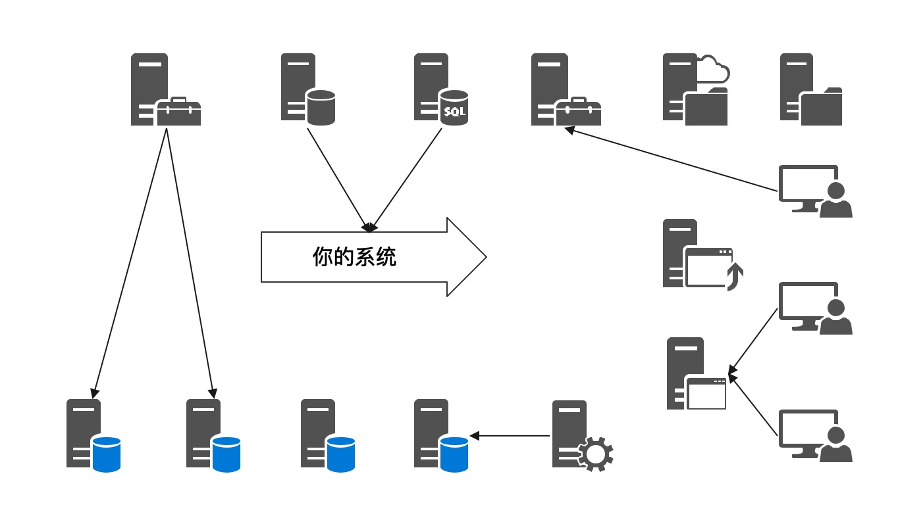
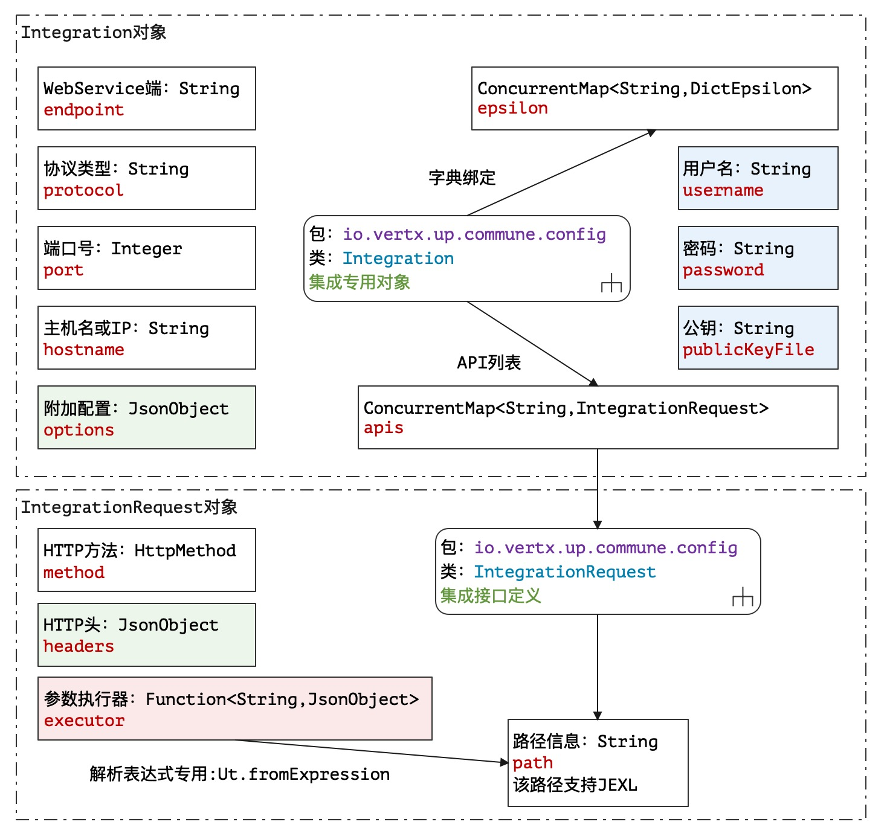

# 天下：集成

> 安得广厦千万间，大庇天下寒士俱欢颜！——杜甫《茅屋为秋风所破歌》

* 项目地址：<https://github.com/silentbalanceyh/vertx-zero-example/>（子项目：**up-crius**）

&ensp;&ensp;&ensp;&ensp;如果之前的内容谈到的是Zero之内，那么本章节主要就是讲解Zero之外，也许从某种意义上讲本章节是最好的**粘合剂**。

> 本文提到的第三方集成通常使用RESTful集成，不考虑第三方的SDK的集成，第三方SDK方式直接阅读SDK文档，参考文档操作。

## 「壹」问题背景

&ensp;&ensp;&ensp;&ensp;通常在项目部署过程中，您部署的项目是进入一个已存在的生态，而不是一个纯环境，即使您可以拿到甲方的**新系统**订单，往往也会面临它的某些旧系统：



&ensp;&ensp;&ensp;&ensp;于是**集成**
自然成为了一个无法绕开的话题。最初的你以为你是整个环境的主角，却忘记了客户环境的现存状况是：设备和系统是一个无序的拓扑图，而当你入局时，这里其实已经存在很多系统了，这就是赤裸裸的现实，再厉害的架构师都不敢**推倒重来**
，再宽容的甲方也不会允许上了一个系统过后对环境产生破坏性的效果。 &ensp;&ensp;&ensp;&ensp;本章节讲解Zero提供的一个内置组件`WebClient`
，使用它您就可以十分方便和第三方系统集成，同时可以省掉您去思考集成的技术性环节。

### 1.1. 两种模式

&ensp;&ensp;&ensp;&ensp;通常系统集成有两种模式：**拉取和推送**，至于古老的直接访问视图和数据库的这种野性操作我们就不讨论了，这种分类维度是和数据的走向相关。

* **拉取**：数据源在第三方系统，我们将数据读取到自己的系统里。
  
* **推送**：数据源在自己的系统，我们将数据写入到第三方系统里。
  

&ensp;&ensp;&ensp;&ensp;这两种模式在选择的时候需要我们根据实际场景来思考，特别是如何处理系统本身面临的均衡性问题：

1. 您的系统是否需要强实时性？
2. 集成的数据量的规模是否作为考虑因素？
3. 采用了某种模式后，是否可以保证绝对的性能？

&ensp;&ensp;&ensp;&ensp;以上只是一个实际的思考，如何在您的系统中做到**均衡**
是一个大课题，而且这个课题几乎是探索性课题，您没有办法一击命中直接在环境中做到绝对的均衡。系统集成时的模式选择也会影响到均衡性问题，比如：甲方每天需要同步100万账号数据，您开发了任务系统在每天晚上拉取数据，很快就可以同步完成，但在这种场景下如果他要求白天任何时候账号都是最新状态，而对方系统又没有办法做实时推送更新到你的系统，这样的场景怎么解决呢？

&ensp;&ensp;&ensp;&ensp;其实我们应该考虑的第一个问题不是怎么解决，而是是否真有必要解决？很多需求从甲方视角看，是一个系统的**完美态**，可从开发人员视角，**完美**
的系统永远都不存在，所以很多时候需求掉入了甲方和乙方无限争吵的怪圈。很多时候我们思考的解决方案不能多方面照顾，所以需要一定的折中，如果你不思考，那么最终的结果就是灾难。产品经理为什么会和程序员吵架，其主要原因就是产品经理有时候不考虑功能的产出增益，它只要功能，却不去考虑这个功能的必要性和成本，这样的产品经理你就洗洗睡吧，梦里有你想要的所有产品。

&ensp;&ensp;&ensp;&ensp;扯远了，归根到底根据数据流细分集成的两种模式是思考集成最好的起点。

### 1.2. 难点

&ensp;&ensp;&ensp;&ensp;不就是读取个数据？不就是写入个数据？您是否也如此认为呢？就像很多人觉得“不就是个CRUD系统”一样的呆萌。是的！不可否认集成本身要拉通流程几乎是无成本的，只要对方提供了详细的**接口规范**
，那么对你而言集成任务很容易搞定，可是你别忘了一点，**接口规范**的复杂度会使得你的集成工作量指数级上升。

&ensp;&ensp;&ensp;&ensp;假设有一个属性`address`，从数据上看它就是一个常用的字符串，代表地址，但您现在遇到了单个属性的难题：

1. 对方的`address`出现了和数据规范文档不一致的长度。
2. 对方的`address`需要和其他字段执行级联校验（这个本不该你做，但你别忘了，一旦数据进入你的系统，甲方甩脸是给你不是给第三方）。
3. 对方的`address`出现了不符合业务规范的**脏数据**。
4. 对方的`address`在数据结构上和您定义的结构不一致。
5. 对方的`address`出现了空指针。
6. 对方的`address`因为版本升级出现了格式差异。
7. …………

&ensp;&ensp;&ensp;&ensp;其实这只是一个字段的问题，如果这个**业务主体**有两三百个字段呢（以前很多旧系统都如此，随着复杂度自然膨胀）？如果每个字段都这样考虑问题，那么这个集成可以不用做了，这完全是**维度**
灾难。相信学过软件工程的读者都知道软件测试原理，在设计测试用例时，铁定不是面面俱到，也不可能面面俱到，再完美的测试工程师都不敢说我已经测试了**所有的情况**，这和函数式编程过程中将所有函数都写成**全函数**
异曲同工——但是某些函数天生具有副作用。

&ensp;&ensp;&ensp;&ensp;集成的难点也在此，而集成的工作量和维护量都在此。

## 「贰」开发详解

&ensp;&ensp;&ensp;&ensp;言归正传，回到Zero中的**第三方客户端**。

### 2.1. Integration

&ensp;&ensp;&ensp;&ensp;Integration类（`io.vertx.up.commune.config.Integration`
）是Zero设计的集成定义对象，它用来描述和第三方集成时候的配置信息，有了该配置您的集成不仅可以避免**硬编码**，还可以让您的集成很容易迁移。

#### 2.1.1. 属性说明

&ensp;&ensp;&ensp;&ensp;该类结构图如下：



&ensp;&ensp;&ensp;&ensp;说明几点：

1. 认证主要以用户名username和密码password为主，`publicKeyFile`模式是项目中出现了特殊需求才定制，有了用户名和密码配合客户端中令牌（Token）的运算可满足大部分应用的集成。
2. 协议protocol在实战中常用的是`http`和`https`两种。
3. IntegrationRequest是集成配置的子对象，它用来描述某个接口，它的path属性可支持Jexl表达式，您可以填充参数来完善该表达式生成最终请求地址。

```json
    "assignment": {
        "path": "`/cmdb?start=${start}&count=${count}`",
        "method": "GET"
    }
```

> 上边代码段中包含了Jexl表达式，而图中DictEpsilon在普通场景几乎不会使用，它牵涉Zero中的另外一个偏业务的功能：数据字典。

#### 2.1.2. 配置内容

&ensp;&ensp;&ensp;&ensp;一份完整的Integration对应的Json配置如下：

```json
 {
      "endpoint": "http://www.demo.cn/ws/api/",
      "port": 1234,
      "username": "lang",
      "password": "xxxx",
      "hostname": "www.demo.cn or 192.168.0.12",
      "publicKeyFile": "public key path",
      "apis":{
          "get.username": {
              "method": "POST",
              "uri": "/uri/getinfo",
              "headers": {}
          },
          "post.test": {
              "method": "GET",
              "uri": "/uri/getinfo",
              "headers": {}
          }
      },
      "options":{
          "debug": false
      }
 }
```

&ensp;&ensp;&ensp;&ensp;上述配置的`options`节点中有一个特殊参数`debug`
，该节点是一种约定，它可以让您打开Zero中的模拟环境而实现不直接连接第三方集成客户端进行隔离测试。之前在讲Shell时我提到过环境参数，Zero中的环境定义（`io.vertx.up.eon.em.Environment`）如下：

|值|含义|
|---|:---|
|Development|开发环境|
|Production|生产环境|
|Mockito|模拟环境（集成专用）|

&ensp;&ensp;&ensp;&ensp;上边配置中的`apis`节点片段如下：

```json
          "get.username": {
          },
          "post.test": {
          }
```

&ensp;&ensp;&ensp;&ensp;此处的`get.username`以及`post.test`称为**接口标识**，该标识由开发人员人工定义，并且在编程时只会直接使用该标识，而不会去使用内容层，它同时是`apis`属性的**
键**。

```java
ConcurrentMap<String, IntegrationRequest> apis = new ConcurrentHashMap<>();
```

#### 2.1.3. 重要API

> 此处不讲Integration中的`get/set`类型的JavaBean规范的API。

**配置读取**

```java
// 带默认值读取
public <T> T getOption(final String optionKey, final T defaultValue)
// 不带默认值读取
public <T> T getOption(final String optionKey)
```

&ensp;&ensp;&ensp;&ensp;前一小节的Json结构中，包含了`options`节点，该节点就是配置读取类API的根节点，它可以帮助您快速读取配置数据，由于使用了泛型`T`，您可以直接在代码中写类似下边这种：

```java
final boolean isDebug = integration.getOption("debug", Boolean.FALSE);
```

**模拟环境**

```java
// 在 options 中追加 debug = true
public void mockOn()
// 在 options 中追加 debug = false
public void mockOff()
```

**创建请求**

```java
// 此处的key就是前文提到的接口标识
public IntegrationRequest createRequest(final String key)
```

&ensp;&ensp;&ensp;&ensp;集成请求在发送时，会根据您的key定义创建一个IntegrationRequest的**副本**，主要目的是防止运行时对IntegrationRequest的**修改影响**了原始定义数据。

### 2.2. 集成客户端

#### 2.2.1. 抽象层

&ensp;&ensp;&ensp;&ensp;集成客户端在Zero中只提供了抽象类：

```java
package io.vertx.up.uca.cosmic;

import io.vertx.core.MultiMap;
import io.vertx.up.commune.config.Integration;
import io.vertx.up.uca.cosmic.security.WebToken;
import org.apache.http.HttpHeaders;

import java.util.Objects;

public abstract class AbstractWebClient {
    protected final transient Emitter emitter;
    protected final transient Integration integration;

    public AbstractWebClient(final Integration integration) {
        this.emitter = Emitter.create(integration);
        this.integration = integration;
    }

    protected Emitter emitter() {
        return this.emitter;
    }

    protected MultiMap headers() {
        final MultiMap headers = MultiMap.caseInsensitiveMultiMap();
        final WebToken token = this.token();
        if (Objects.nonNull(token)) {
            headers.add(HttpHeaders.AUTHORIZATION,this.token().authorization());
        }
        return headers;
    }

    public WebToken token() {
        return null;
    }
}
```

&ensp;&ensp;&ensp;&ensp;该客户端中有两个核心对象：

1. WebToken：用于创建不同认证模式的令牌。
2. Emitter：发送请求的执行接口。

#### 2.2.2. WebToken

&ensp;&ensp;&ensp;&ensp;WebToken的定义如下：

```java
    /* 根据您提供的自定义算法提供的令牌计算结果 */
    String token();

    /* 计算您将要放到HTTP请求头 Authorization 中的完整字符串。*/
    String authorization();
```

&ensp;&ensp;&ensp;&ensp;Zero环境中提供了最常用的Basic认证模式的WebToken实现：

```java
package io.vertx.up.uca.cosmic.security;

import io.vertx.up.commune.config.Integration;
import io.vertx.up.util.Ut;

public class BasicToken implements WebToken {
    private final transient String token;

    public BasicToken(final Integration integration) {
        this.token = Ut.encryptBase64(
            integration.getUsername(), integration.getPassword());
    }

    @Override
    public String token() {
        return this.token;
    }

    @Override
    public String authorization() {
        return "Basic " + this.token;
    }
}
```

&ensp;&ensp;&ensp;&ensp;上边代码是最简单的实现，再提供一种实现（另外一个环境）：

```java

public class Cmdb1Token implements WebToken {
    private final transient Emitter emitter;
    private final transient String token;

    Cmdb1Token(final Integration integration) {
        this.emitter = Emitter.create(integration);

        /* 用户名 / 密码 读取 token */
        final JsonObject request = new JsonObject();
        request.put(KName.USERNAME, integration.getUsername());
        request.put(KName.PASSWORD, integration.getPassword());
        request.put("rememberMe", Boolean.FALSE);

        /* 申请Token */
        this.token = this.accessToken(request);
    }

    @Override
    public String token() {
        return this.token;
    }

    @Override
    public String authorization() {
        return "Bearer " + this.token;
    }

    private String accessToken(final JsonObject params) {
        final JsonObject token = this.emitter.requestJ(C1Cv.Api.TOKEN, params);
        return token.getString("access_token");
    }
}
```

#### 2.2.3. Emitter

&ensp;&ensp;&ensp;&ensp;Emitter接口才是真正的执行接口，它为您发送HTTP请求提供了更多的选择，即使没有AbstractWebClient，您同样可以直接使用Integration构造Emitter对象发送请求，该接口的API定义如下：

&ensp;&ensp;&ensp;&ensp;返回值为**String**：

```java
// 返回String，带headers
String request(String apiKey, JsonObject params, MultiMap headers);
// 返回String，不带headers
default String request(final String apiKey, final JsonObject params) {
    return this.request(apiKey, params, MultiMap.caseInsensitiveMultiMap());
}
//「异步」返回String，带headers
default Future<String> requestAsync(
    final String apiKey, final JsonObject params, final MultiMap headers) {
    return Ux.future(this.request(apiKey, params, headers));
}
//「异步」返回String，不带headers
default Future<String> requestAsync(
    final String apiKey, final JsonObject params) {
    return Ux.future(this.request(apiKey, params));
}
```

&ensp;&ensp;&ensp;&ensp;返回值为**JsonObject**：

```java
// 返回JsonObject，带headers
JsonObject requestJ(String apiKey, JsonObject params, MultiMap headers);
// 返回JsonObject，不带headers
default JsonObject requestJ(final String apiKey, final JsonObject params) {
    return this.requestJ(apiKey, params, MultiMap.caseInsensitiveMultiMap());
}
// 「异步」返回JsonObject，带headers
default Future<JsonObject> requestAsyncJ(
    final String apiKey, final JsonObject params, final MultiMap headers) {
    return Ux.future(this.requestJ(apiKey, params, headers));
}
// 「异步」返回JsonObject，不带headers
default Future<JsonObject> requestAsyncJ(
    final String apiKey, final JsonObject params) {
    return Ux.future(this.requestJ(apiKey, params));
}
```

&ensp;&ensp;&ensp;&ensp;返回值为**JsonArray**：

```java
// 返回JsonArray，带headers
JsonArray requestA(String apiKey, JsonObject params, MultiMap headers);
// 返回JsonArray，不带headers
default JsonArray requestA(final String apiKey, final JsonObject params) {
    return this.requestA(apiKey, params,MultiMap.caseInsensitiveMultiMap());
}
// 「异步」返回JsonArray，带headers
default Future<JsonArray> requestAsyncA(
    final String apiKey, final JsonObject params, final MultiMap headers) {
    return Ux.future(this.requestA(apiKey, params, headers));
}
// 「异步」返回JsonArray，不带headers
default Future<JsonArray> requestAsyncA(
    final String apiKey, final JsonObject params) {
    return Ux.future(this.requestA(apiKey, params));
}
```

#### 2.2.4. 实战代码

&ensp;&ensp;&ensp;&ensp;最后开放一份WebClient的**完整实战代码**，让读者对整个集成部分有更深的认识：

```java
package cn.originx.itsm.service;

import cn.originx.itsm.cv.SmCv;
import cn.originx.itsm.refine.Sm;
import cn.originx.refine.Ox;
import cn.vertxup.erp.domain.tables.daos.ETeamDao;
import cn.vertxup.erp.domain.tables.pojos.ETeam;
import io.vertx.core.Future;
import io.vertx.core.json.JsonArray;
import io.vertx.up.commune.config.Integration;
import io.vertx.up.uca.cosmic.AbstractWebClient;
import io.vertx.up.uca.cosmic.security.BasicToken;
import io.vertx.up.uca.cosmic.security.WebToken;
import io.vertx.up.unity.Ux;

import java.util.List;

public class TeamRunner extends AbstractWebClient implements Coordinator {
    public TeamRunner(final Integration integration) {
        super(integration);
    }

    @Override
    public WebToken token() {
        return new BasicToken(this.integration);
    }

    @Override
    public Future<JsonArray> fetchAsync() {
        // Mock Flow
        return Ox.mockAsyncA(this.integration, SmCv.Mock.MOCK_TEAM,
        // 此处由于无法显示完全改过代码排版
        () -> Sm.requestPage(pagination -> Sm.pagination(pagination)
        .compose(params ->
            this.emitter.requestAsyncJ("assignment", params, this.headers())
        )));
    }

    @Override
    public Future<JsonArray> insertAsync(final JsonArray inserted) {
        final List<ETeam> teamList = Ux.fromJson(inserted, ETeam.class);
        return Ux.Jooq.on(ETeamDao.class)
                .insertAsync(teamList)
                .compose(Ux::futureA);
    }

    @Override
    public Future<JsonArray> updateAsync(final JsonArray updated) {
        final List<ETeam> teamList = Ux.fromJson(updated, ETeam.class);
        return Ux.Jooq.on(ETeamDao.class)
                .updateAsync(teamList)
                .compose(Ux::futureA);
    }
}
```

## 「叁」小结

&ensp;&ensp;&ensp;&ensp;本文内容十分集中，主要讲解Zero中如何和第三方系统集成，当然从本章功能可以知道，目前Zero中支持的方式比较有限，如不支持上传下载、特殊模式下安全认证、多阶段的令牌获取、非提供格式的响应解析、分页参数等这些功能目前都没在Zero中提供。

> 我们生产环境第三方集成系统超过二十个，利用本章内容一定程度上提高了开发维护效率。

