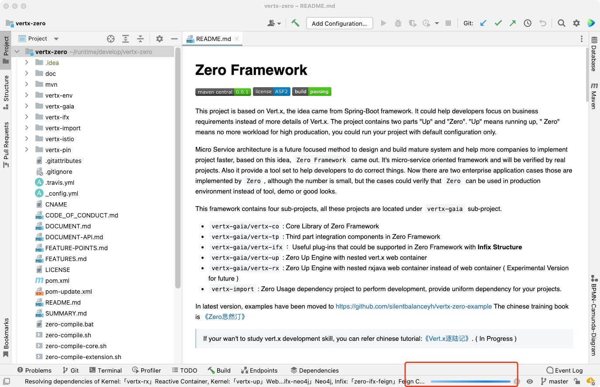
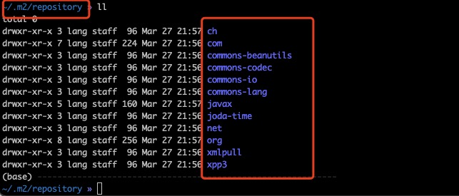
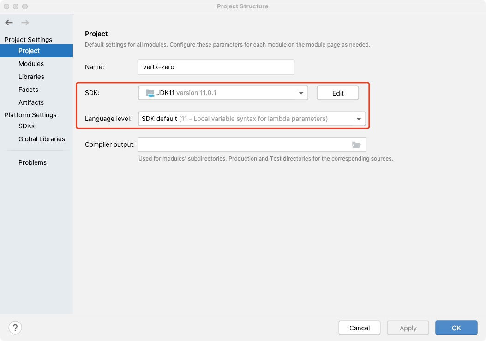
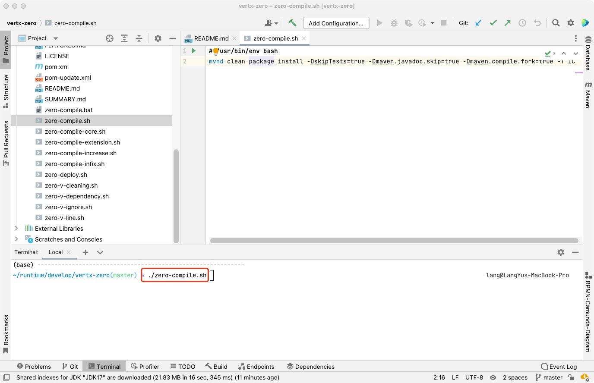

> 冰缩寒流，川凝冻霭，前回鹭渚冬晚。燕阁红炉，驼峰翠釜，曾忆花柔酒软。――刘天游《氐州第一》

* 项目地址：<https://github.com/silentbalanceyh/vertx-zero-example/>

&ensp;&ensp;&ensp;&ensp;本篇为实战总结帖，主要用于多个项目同时运行时的统一文档，目前Zero上已经运行了几个比较重量级的项目，本文主要针对几个平台从环境搭建、开发、运行、测试到部署进行基于实战的讲解，以Step-By-Step的方式让开发人员能更加流程搭建Zero的企业实战开发环境。本文内容和原始教程中的内容略微有些出入，是因为引用了更多Zero Extension中的模块来辅助开发，所以此文算是Zero Core和Zero Extension的交叉参考教程。

# 「壹」环境搭建

## 1.1. 基础环境

&ensp;&ensp;&ensp;&ensp;最新的依赖库版本如下：

|依赖库|类型|版本|
|---|---|---|
|NodeJs|前端|16.14.0|
|Ant Design|前端|3.26.19|
|React|前端|16.14.0|
|JDK|后端|11|
|Maven|后端|3.8.5|
|Zero|后端|0.8.1 ~|
|Vertx|后端|4.2.6|
|ElasticSearch|集成（全文检索）|7.x ~|
|Neo4j|集成（拓扑图）|4.x ~|
|Camunda|集成（工作流）|7.x ~|
|MySQL|数据库|5.x|
|Oracle|数据库|12.x|
|TiDB|数据库|5.x|

&ensp;&ensp;&ensp;&ensp;**特殊说明**

* JDK的版本推荐使用ZuLu的开源JDK：<https://www.azul.com/downloads/>
* Maven推荐使用mvnd工具：<https://github.com/apache/maven-mvnd/releases>
* 如果使用了**动态建模**（zero-atom）功能，则需要根据您的数据库下载相关依赖库：<https://github.com/silentbalanceyh/vertx-zero/tree/master/vertx-pin/zero-vista>，若是其他类型数据库需参考内置源代码自己写一套基础插件。
* 集成部分的ElasticSearch、Neo4j、Camunda根据您自身项目情况而定。
* **动态建模**/**动态路由**功能根据您自身项目情况而定。
* Maven的仓库推荐使用中心仓库，以防止部分jar包无法从代理仓库下载。

&ensp;&ensp;&ensp;&ensp;本教程**假设**您的基本环境如下：

|实体|必须/可选|类型|含义|
|---|---|---|---|
|本地开发|x|工作目录|~/runtime/develop|
|Maven仓库|x|依赖库目录|~/.m2/repository|
|生产部署|x|工作目录|~/runtime/server|
|生产存储|可选|工作目录|~/runtime/zero-store/|
|`DB_DEMO`|x|数据表|数据库中的主库|
|`DB_DEMO_WF`|可选|数据表|数据库中工作流专用库（Camunda库）|
|`DB_DEMO_HIS`|可选|数据表|数据库中的删除历史库|
|`DB_XX`|可选|数据表|动态建模专用库|

&ensp;&ensp;&ensp;&ensp;**注**：可选部分根据您搭建环境过程中选择的zero extension模块进行相关定义，最新版的模块化会自动化部署相关模块已经环境内容，详细部分参考后续章节。

## 1.2. 开发环境

### 1.2.1. zero

&ensp;&ensp;&ensp;&ensp;如果您不关注最新版的功能，直接使用`0.8.1`版本，则可**跳过该步骤**，由于zero本身是一个跟着项目成长很迅速的项目，所以在`1.0`版本发布之前，个人推荐紧跟最新版本走。虽然最新版本是`X-SNAPSHOT`，基础功能已经经过了生产环境验证，所以该版本是可靠的；再者，最新版本会包含一部分重用性极高的新功能，如`0.9.0-SNAPSHOT`中引入的：

* 文档管理平台（FTP、SSH）
* 模块化管理平台（License、Modulat）
* 工作流标准化平台（ITSM、ISO）
* WebSocket功能（正在开发中，用于提醒）
* 短信邮件集成

#### 1）基本步骤

1. 进入目录`~/runtime/develop/`中，下载`vertx-zero`代码到环境中：

    ```shell
    # 由于是只读类型，所以可不带access_token的模式拉取开源代码
    ~/runtime/develop >> git clone https://github.com/silentbalanceyh/vertx-zero.git
    # 命令执行后的输出如下
    Cloning into 'vertx-zero'...
    remote: Enumerating objects: 62003, done.
    remote: Counting objects: 100% (17224/17224), done.
    remote: Compressing objects: 100% (6252/6252), done.
    remote: Total 62003 (delta 8657), reused 16131 (delta 8157), pack-reused 44779
    Receiving objects: 100% (62003/62003), 87.48 MiB | 15.39 MiB/s, done.
    Resolving deltas: 100% (35166/35166), done.
    Updating files: 100% (4850/4850), done.
    ```

2. 下载完成后`~/runtime/develop`中会有一个`vertx-zero`目录，使用IDEA导入该目录中的项目：
    * 2.1. 启动IDEA
    
    * 2.2. 选中下载的`vertx-zero`目录
    
    * 2.3. 在弹出的对话框中选择`Open as Project`（以项目方式打开）
    
    * 2.4. 如果弹出下边对话框，则直接勾选`Trust projects in ~/runtime/develop`，然后点击`Trust Project`
    
    * 2.5. 然后等待右下角的项目初始化完成
    
    * 2.6. 点开进度条会看到正在执行的后台任务：
    
    * 2.7. 项目初始化过程中，系统会下载部分所需的Maven依赖包，您的Maven库中会开始有内容（**注：如果之前您的Maven目录中已存在相关库，则可忽略，Demo从空Maven库开始初始化以方便初学者。**）：
    
3. 导入完成后，先检查IDE中的JDK运行环境是否符合：**File -> Project Structure...**，推荐**11**。
    
4. 打开Terminal终端，使用内置脚本（**mvnd环境**）编译`vertx-zero`：

    
    ```shell
    # zero中内置脚本主要用于快速编译以及增量编译框架，其中内容如下：
    # 1）完整编译（常用）                -- zero-compile.sh
    # 2）增量编译                       -- zero-compile-increase.sh
    # 3）「部分」编译核心框架             -- zero-compile-core.sh
    # 4）「部分」编译扩展框架             -- zero-compile-extension.sh
    # 5）「部分」编译插件                -- zero-compile-infix.sh
    # 
    ~/runtime/develop/vertx-zero(master) >> ./zero-compile.sh
    # zero-compile.sh脚本内容如下
    # mvnd clean package install -DskipTests=true -Dmaven.javadoc.skip=true -Dmaven.compile.fork=true -T 1C
    # 最终输出如下
    [INFO] ------------------------------------------------------------------------
    [INFO] BUILD SUCCESS
    [INFO] ------------------------------------------------------------------------
    [INFO] Total time:  15.021 s (Wall Clock)
    [INFO] Finished at: 2022-03-27T22:32:07+08:00
    [INFO] ------------------------------------------------------------------------
    ```

#### 2）小结

&ensp;&ensp;&ensp;&ensp;上述步骤的编译不会触发zero的测试流程，如果使用`mvnd clean package install`方式处理，会触发zero的测试流程，使得整个框架编译的时间拉长，所以不推荐`clean package install`方式，这种方式仅留给zero的研发人员使用。编译成功过后，您的开发环境的Maven库中就有了最新的zero版本，目前是`0.9.0-SNAPSHOT`，您就可以执行后续步骤了。

### 1.2.2. 项目后端

#### 1）新项目搭建

&ensp;&ensp;&ensp;&ensp;

#### 2）项目导入

&ensp;&ensp;&ensp;&ensp;

### 1.2.3. 项目前端


## 1.3. 生产部署

### 1.3.1. 命令工具

### 1.3.2. 后端启动

### 1.3.3. 前端启动

# 「贰」核心功能配置

## 2.1. 驱动层配置

### 2.1.1. 端口号和跨域

### 2.1.2. 建库/导入

### 2.1.3. 工作流引擎

### 2.1.4. 开发中心

### 2.1.5. 常用命令

### 2.1.6. 集成配置

## 2.2. 基础层配置

### 2.2.1. 文档管理

### 2.2.2. 环境管理

### 2.2.3. 模块化配置

### 2.2.4. Auditor配置

### 2.2.5. 调试开关

# 「叁」总结
